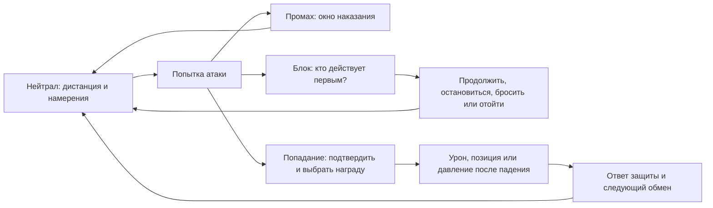

# PULSE / Arena: исследование боевой системы и ориентир развития

Дата: **1 октября 2026 года**. Проверенная версия проекта: `8a1e0b1b2bea0e1e7f29b2908333044506b7ea01`.

Результат: анализ существующей игры, сравнительное исследование, проект целевой боёвки и план проверяемых экспериментов. Это **предложение для следующих итераций**, а не описание уже внесённых изменений в правила.

**Главная рекомендация:** строить отзывчивый дуэльный файтинг с понятной борьбой за дистанцию и инициативу, короткими осмысленными комбинациями и разными стилями персонажей. Сохранить простое управление и квартиру как узнаваемую сцену. Первой целью сделать ситуацию, в которой двум людям интересно сыграть ещё несколько боёв одним и тем же бойцом, без наград за участие.

Если нужен один главный ориентир, для PULSE я выбираю **Street Fighter 6 как пример целостного современного продукта**. Но целевую систему следует проектировать под телефон: ясность взаимодействий брать у Virtua Fighter, доступность команд — у Fantasy Strike и Granblue Fantasy Versus: Rising, выразительность контакта — из практики анимации Skullgirls. Это авторская рекомендация по соответствию нашему проекту, **не установленный мировой рейтинг**. Механики этих игр нельзя просто сложить: у них разные правила защиты, движения и темпа.

## Как читать

- Для решения о направлении: [эталоны](#benchmarks), [аудит PULSE](#audit), [целевая дуэль](#target), [порядок работ](#roadmap).
- Для проектирования правил: [атака, защита и комбо](#rules), [конкретный прототип](#prototype).
- Для ощущения боя: [подача контакта, управление и сеть](#feel).
- Для проверки, стало ли интереснее: [пользовательские тесты и критерии](#evaluation).
- [Источники](#sources) и [воспроизводимость](#reproduction).
- Что уже внедрено по этому документу: [итерация 1, 5 октября 2026](#iteration1).

<a id="benchmarks"></a>

## 1. Какая боевая система считается лучшей

### 1.1. Единственного эталона нет

«Лучший файтинг» может означать лучший нейтрал, максимальную свободу комбо, выразительную защиту, доступность для новичка, честную сетевую игру или самые зрелищные матчи. Эти цели иногда конфликтуют. Длинные комбинации дают атакующему самовыражение, но могут лишать соперника участия. Множество защитных опций расширяет выбор, но увеличивает объём обучения. Упрощённый ввод облегчает исполнение и одновременно меняет баланс атак, которые раньше ограничивались сложностью команды.

Поэтому вопрос для PULSE точнее сформулировать так: **какие решения игрок должен получать каждые несколько секунд, почему он сможет их понимать и зачем захочет осваивать их дальше?**

### 1.2. Сравнение полезных ориентиров

В таблице свойства игр подтверждаются указанными первичными источниками; выбор того, что переносить в PULSE, — наш вывод.

| Ориентир | Что особенно полезно изучить | Что переносить в PULSE | Чего не копировать автоматически |
|---|---|---|---|
| **Street Fighter 6** | Общий ресурс Drive используется для нескольких атакующих и защитных действий; истощение меняет ситуацию. Modern упрощает команды | Цена инициативы, понятный выбор между атакой и защитой, доступность исполнения | Полный набор Drive, отдельные суперресурсы, сложность управления консольной игры. [Capcom][S1] |
| **Virtua Fighter** | Связь удара, блока и броска; преимущество после взаимодействия; роль дистанции и края арены | Каждая сильная опция должна иметь объяснимый ответ; движение должно менять исход | Всю трёхмерную систему уходов в глубину, десятки команд, специфические правила уровней ударов. [SEGA][S2] |
| **Fantasy Strike** | Простые команды, визуализация преимущества, покадровая тренировка | Быстро довести новичка до осмысленного выбора; сделать правила наблюдаемыми | Авторское заявление о превосходстве по глубине как объективно доказанный факт. [Дэвид Сирлин][S3] |
| **Granblue Fantasy Versus: Rising** | Навыки одним нажатием, доступные короткие цепочки, отдельные способы продолжить или остановить давление | Малое число удобных команд может обслуживать содержательную дуэль | Все ресурсы и универсальные продолжения сразу. [Cygames: система][S4], [команды][S5] |
| **Guilty Gear -Strive-** | Roman Cancel как расход ресурса на изменение ситуации; Burst как выход из опасности | У атакующего есть выбор продолжения; у защищающегося есть редкий осознанный выход | Полную свободу отмен без готового баланса и длинные воздушные маршруты. [Arc System Works][S6] |
| **Killer Instinct** | Взаимодействие combo / combo breaker / counter breaker; помощь в выполнении комбо | Изучать участие защищающегося во время серии и цену попытки вырваться | Сделать каждое попадание отдельной угадайкой из трёх кнопок. Это самостоятельная игровая система. [Официальное руководство][S7] |
| **Tekken 8** | Практика настройки риска и награды, защиты от давления, тренировочных ответов | Изучать не только яркие механики, но и причины их пересмотра | Принимать современность, зрелищность или число приёмов за гарантию хорошего баланса. [Политика 2.01][S8], [планы 3.00][S9] |
| **Skullgirls / доклады Mariel Cartwright** | Силуэты, ключевые позы и тайминг анимации в жёстких игровых ограничениях | Сначала нужный боевой ритм, затем анимация, которая ясно его передаёт | Удлинять восстановление только ради красивого полного mocap-клипа. [Доклад и слайды][S10] |

Исторические игры вроде Street Fighter III: 3rd Strike полезны как отдельные референсы. Например, Cartwright разбирает его анимационные приёмы. Но репутация классики не доказывает, что её требования к реакции, исполнению и обучению подходят новой аудитории Telegram. [Слайды, примеры Third Strike][S10]

### 1.3. Особенно важный урок из реальных пересмотров

В мае 2025 года команда Tekken 8 прямо обозначила проблемы чрезмерной награды при недостаточном риске, последовательного давления и большого урона воздушных серий. В феврале 2026 года она вновь сформулировала критерии: работают ли переходы между атакой и защитой, вознаграждается ли правильный уход, не слишком ли дорого обходится одна ошибка. Это не доказательство, что Tekken «плохой»; это пример того, что даже большой проект должен постоянно проверять участие обоих игроков. [Bandai Namco, 2.01][S8], [Season 3][S9]

Похожий урок даёт баланс Killer Instinct: изменение награды за breaker рассматривалось вместе с ценностью длинного комбо и ситуацией после выхода. Отдельную защитную кнопку нельзя оценивать без всей цепочки последствий. [Iron Galaxy, 3.6][S11]

**Для PULSE:** добавление новой возможности оправдано, когда она создаёт полезный выбор или исправляет конкретную проблему. Само количество возможностей не является целью.

## 2. Что исследовано и где заканчиваются доказательства

Использованы три независимых вида материала:

1. **Первичные внешние источники:** официальные руководства, объяснения разработчиков, политики балансировки, GGPO и доклад ведущего аниматора. Проверка ссылок — 01.10.2026. Исторический патч используется как свидетельство решения разработчиков, а не как описание текущих чисел игры.
2. **Аудит реализации PULSE:** `combat/src/lib.rs`, `moves.rs`, `room.rs`, клиент ввода и звука, серверная очередь и доставка ввода, анимация, камера, события, протокол, существующие тесты.
3. **Локальные наблюдения:** сборка, запись сценария `moves` в портретном viewport 390×844, просмотр контактных листов; отдельный Rust-пробник времени восстановления, преимущества на блоке и защиты при подъёме.

В документе различаются:

- **Факт:** правило непосредственно есть в коде либо результат воспроизведён пробником.
- **Вывод:** объяснение того, почему правило может ухудшать впечатление.
- **Гипотеза:** предлагаемое изменение, которое ещё необходимо сравнить с текущим вариантом.

Не проводились интервью с нашими игроками, инструментальные замеры физических телефонов, сетевой эксперимент с реальным RTT, полноценные человеческие PvP-сессии и сравнительный пользовательский тест коммерческих игр. Поэтому здесь нет утверждений, что конкретная механика уже доказанно вызывает отток или что предложенные числа гарантируют удовольствие. Запись через Playwright проверяет внешний вид; она не заменяет ощущение двух больших пальцев на экране.

Также нет единого исследования, доказывающего «объективно лучшую боёвку для всех». Маркетинговые заявления разработчиков и их личные оценки не принимаются за такой результат.

<a id="audit"></a>

## 3. Где PULSE находится сейчас

### 3.1. Сильная основа уже есть

Одинаковое детерминированное ядро работает в тренировке и на сервере. Есть фиксированные 60 Гц, данные приёмов, буфер ввода, старт/активность/восстановление, различные уровни атак, парирование, отмены после попадания, масштабирование комбо, предел воздушной серии, захваты, ресурсы и физические реакции. Результат рассчитывает сервер. Клипы привязаны к боевому времени.

Это существенная база. Следующая задача — согласовать её в понятную систему, а не заново добавлять блок, комбо или хитстоп.

### 3.2. Карта состояния

Ссылки ведут к файлам; ориентиры внутри них — имена функций, поэтому таблица полезна и после сдвига строк.

| Область | Подтверждённое состояние | Что это означает для следующей итерации |
|---|---|---|
| Правила и данные | Общие `Match::step()` и `moves::attack()`; 11 атакующих action ID | Хорошее место для управляемых экспериментов. [Ядро](../combat/src/lib.rs), [таблица](../combat/src/moves.rs) |
| Пространство | Одна боевая линия X, высота Y; персонажи не пересекаются; фиксированное направление | Это **2.5D-дуэль с 3D-графикой**, а не пространственный Tekken. Уход в глубину потребует нового дизайна |
| Нейтрал | Ходьба, присед, прыжок, рывок; общая арена шириной 23 м | Проверить ценность мелких шагов и время возвращения в контакт. [Границы](../combat/src/room.rs) |
| Попадание | Дистанция между центрами + уровень + вертикальный порог | Отдельных активных hitbox/hurtbox конечностей нет; вытянутую руку нельзя наказывать как отдельную уязвимую область |
| Защита | Отдельная кнопка блока, верх/низ; свежий блок парирует | Защита присутствует; её цена, риск и объяснение нуждаются в проверке |
| Парирование | `guard_age < 6`, без blockstun; 30 тиков стана атакующему, +130 meter защитнику | Большая награда встроена в обычное нажатие блока; специального восстановления неудачной попытки нет |
| Рывок | 24 тика; в кадрах 2–10 попадание не проходит, включая захват; действует в обе стороны | Наступательное сближение одновременно получает сильную защиту |
| Бросок | 13 тиков startup, 1150 мм reach, 17 HP; `HOLD=32`, затем падение | Нет throw tech после захвата; escape до контакта обеспечивают расстояние, прыжок и рывок |
| Давление | Отмены разрешены по подтверждённому попаданию; на блоке ранних отмен нет | Есть комбо, но нет такого же пространства ветвления при удержании защиты |
| Комбо | Разрешённые переходы; снижение урона; ограничение воздушных попаданий | Нужны разные цели завершения, а не просто более длинная цепочка |
| Подъём | `KNOCKDOWN=72`; затем 12 тиков общей неуязвимости | Пауза длинная; неуязвимость не снимается при начале атаки |
| Ресурсы | HP, stamina 0–1000, meter 0–1000; старт meter=400 | Уже три показателя. Новая шкала потребует очень сильного обоснования |
| Спецприём | action 14: дальний ближний удар, цена 500 meter | Отдельной симуляции летящего снаряда нет; визуальная ассоциация с «хадукеном» не означает projectile |
| Выход из комбо | Полный meter, block+dash; в UI «Импульс» меняет действие при готовности | Выход уже существует; проверить ясность смены назначения и возможность вызвать его на телефоне |
| Персонажи | Семь моделей используют одинаковые правила | Это семь обликов одного боевого набора. [Протокол](PROTOCOL.md), [ростер](../assets/fighters/roster.json) |
| Ввод | 12-тактовый буфер ядра; latch 40 мс в JS; сервер копит edge bits | Нужно проверить одинаковую трактовку коротких команд, модификаторов и нескольких быстрых нажатий |
| Сеть | Сервер 60 Гц, снимки 20 Гц, `NET_DELAY=3.5`; нет клиентской предикции боя | Плавное изображение не равно быстрому отклику. [Клиент](../web/arena.js), [сервер](../server/index.mjs) |
| События | В состоянии хранятся счётчик и последнее событие | Для полноценного повтора, нескольких событий за тик и предикции нужен журнал, а не только последний event |
| Подача контакта | Хитстоп, искры, отдача, тряска, звук, вибрация | Нужна согласованность времени и различимость смысла, а не просто больше эффектов |
| Обучение | Справка, бот, манекен, верхний и нижний блок | Нет полноценной практики наказаний, записи dummy, объяснения ошибки и повторов |
| Бот | Правила расстояния, периодические решения, чтение текущих action/frame врага | Нет явной модели восприятия с задержкой и профилей навыка; поведение не доказывает качество PvP |
| Подбор | Очередь берёт следующего доступного соперника | Elo есть, но текущий поиск не подбирает по Elo. Это разные функции |
| Квартира | Разрушение мебели, переходы по комнатам, отскоки от внешних границ | Выразительная сцена; выбор маршрута и связь разрушения с тактикой пока ограничены |

### 3.3. Измерение преимущества на блоке

Метод: центр арены, дистанция 900 мм, заранее удерживаемый правильный блок, без парирования. Приём запускается непосредственно в ядре с frame=0; затем определяются первые следующие тики, когда новый `LIGHT` действительно начинает атаку у каждой стороны. В контексте завершающегося jab это может быть cross. Разность «тик защитника − тик атакующего» приведена ниже. Измерение учитывает порядок обновлений `step()`; это не механическое вычитание полей таблицы.

| Приём | Startup / active / total | Урон | Измеренное преимущество атакующего на блоке |
|---|---:|---:|---:|
| Jab, 1 | 7 / 3 / 24 | 8 | −6 |
| Heavy / overhead, 2 | 21 / 3 / 49 | 21 | −15 |
| Kick, 8 | 11 / 4 / 32 | 11 | −7 |
| Sweep, 9 | 16 / 3 / 43 | 13 | −15 |
| Uppercut, 10 | 13 / 4 / 45 | 15 | −19 |
| Cross, 11 | 6 / 3 / 25 | 9 | −7 |
| Roundhouse, 12 | 12 / 4 / 40 | 17 | −15 |
| Special, 14 | 18 / 5 / 53 | 25 | −20 |
| Room smash, 19 | 18 / 3 / 44 | 14 | −15 |

**Факт:** среди измеренных наземных ударов нет преимущества на блоке. **Вывод:** безопасное продолжение давления очень ограничено; значительная часть боёвки может сводиться к отдельным попыткам попасть и ожиданию. **Не следует** из таблицы, что каждый удар гарантированно наказуем: нужны дистанция после pushback, дальность ответа и точный порядок кадров. Воздушные атаки, поздний контакт и отмены на попадании — отдельные случаи.

Рекомендация — добавить небольшое число осознанных инструментов давления и безопасного завершения, затем проверить ответы на них. Сделать все атаки плюсовыми означало бы заменить одну проблему другой.

### 3.4. Сколько времени отнимает одно попадание

Пробник: те же позиции, противник не сопротивляется, атакующий не продолжает серию. Время от контакта до первого тика, на котором пробная атака действительно запускается; hitstop включён. Округление до сотых секунды.

| Одиночный приём | До первой возможной атаки жертвы | До первой возможной наземной атаки |
|---|---:|---:|
| Throw | 116 тиков ≈ 1,93 с | 1,93 с |
| Sweep | 80 тиков ≈ 1,33 с | 1,33 с |
| Heavy | 107 тиков ≈ 1,78 с | 1,78 с |
| Uppercut | 54 тика ≈ 0,90 с, **атака в воздухе** | 129 тиков ≈ 2,15 с |

Важное исключение: 2,15 с после uppercut нельзя целиком называть непрерывной потерей управления. После окончания stun жертва уже может начать воздушную атаку, а приземление при сохранённом `juggle` снова ведёт к knockdown. Такое промежуточное состояние требует отдельного решения: это намеренное воздушное восстановление или нежелательный побочный эффект правил?

Само по себе длинное падение не «ошибка жанра». Но у нас оно часто повторяется, не даёт выбора подъёма и следует даже за одиночным ударом. Вероятная проблема — малая плотность решений для обоих участников. Проверять нужно всю последовательность: контакт → hitstop → полёт/удержание → пол → подъём → новая угроза.

### 3.5. Правила с особенно высоким риском нежелательных стратегий

1. **Свежий блок с большой наградой.** Попытка парирования при раннем удержании превращается в обычный блок. Повторное отпускание и нажатие обновляет окно. Между нажатиями есть уязвимость, поэтому «бесплатная гарантированная победа» не доказана; однако риск и награда заметно несимметричны. Проверить ритмичный block tapping против разных задержек атаки.
2. **Атака под защитой подъёма.** Пробник `down=1 → step → LIGHT` даёт action=1, frame=0, invulnerable=11. Значит, после подъёма можно начать быстрый удар, сохранив защиту. Это может переворачивать заработанную инициативу и уменьшать смысл knockdown.
3. **Неуязвимое сближение.** И передний, и задний dash избегают ударов и бросков в одном окне. Требуется проверить, не вытесняет ли dash ходьбу и обычную защиту.
4. **Нет отдельных правил броска во время blockstun.** Проверка Grab исключает воздух и `stun`, но не `blockstun`. Сейчас ограниченное давление уменьшает число таких ситуаций; перед добавлением плюсов и block cancel необходимо явно решить допустимость гарантированных бросков.
5. **Непрозрачные отмены.** Следующая атака выбирается с учётом текущего action, а отмена требует `confirmed`. Поэтому одна и та же кнопка может дать другой приём и другое время старта. Это нужно объяснить и показать в тренировке.
6. **Сжатие ввода до маски.** Сервер копит нажатые edge bits, но не их полный порядок и не снимок модификаторов для каждого edge. Короткий «присед + нога», отпущенный до обработки, нужно отдельно сравнить с локальным вводом. Два нажатия одной кнопки между тиками также нельзя восстановить из одного бита. Это риск, выведенный из кода, а не измеренная частота ошибок пользователей.
7. **Последнее событие вместо истории.** Одновременные попадания поддержаны симуляцией, но поля `event_kind/target` вмещают только последний результат. Нельзя считать, что рост event на два позволит восстановить оба события для звука и повторов.

### 3.6. Что видно в мобильном рендере

В сценарии 390×844 просмотрены контактные листы `sheet-2.png` и `sheet-3.png` из `artifacts/research-combat-2026-10-01/`. При близком контакте силуэты достаточно крупные; после разлёта камера показывает большой объём квартиры, и высота бойцов значительно уменьшается. Мелкие конечности оказываются на фоне книжных полок, мебели и вертикальных перегородок. В нескольких ранних кадрах поверх игровой области отображается подсказка об ориентации экрана.

Это подтверждает необходимость проверки масштаба и визуальной иерархии. Контактные листы с частотой один кадр в секунду **не доказывают** рассинхронизацию конкретного удара, качество всех анимаций или реальный FPS телефона. Для такого вывода нужны покадровые записи и временные метки событий.

### 3.7. Документация уже расходится с кодом

В `PROTOCOL.md` осталось «knockdown lasts 36 ticks», тогда как код содержит 72. Там же сохранилась фраза об отсутствии рейтинга, хотя рейтинг реализован. В README встречаются старые описания разрушаемых внешних стен. При последующих изменениях источником чисел должны быть данные ядра и воспроизводимый прогон, а документация должна обновляться вместе с ними. Иначе балансировщик и аниматор будут улучшать разные версии правил.

<a id="target"></a>

## 4. Целевая игра: понятная дуэль с запасом глубины

### 4.1. Пять опор

1. **Намерение исполняется.** Игрок хотел шагнуть, остановиться и ударить — персонаж сделал именно это, с понятной задержкой.
2. **Ситуация читается.** Видно, что произошло: промах, блок, попадание, опасное восстановление или удачная контратака.
3. **У обоих есть решения.** Даже защищающийся понимает, чего ждёт и какие у него ответы; длительность принудительного ожидания ограничена.
4. **Навык меняет результат.** Дистанция, выбор ответа, подтверждение попадания и чтение привычек дают преимущество над случайными кнопками.
5. **Есть собственный характер.** Разные планы бойцов, короткие выразительные сцены контакта, квартира и её разрушение запоминаются без перегруза правил.

Простые команды сохраняем. Сложность исполнения и стратегическая глубина — разные проектные переменные. Опыт упрощённых команд у Capcom и Cygames показывает, что этот путь существует; насколько он удачен для нас, определит тест телефона и PvP. [Modern][S1], [простые навыки GBVSR][S5]

### 4.2. Как должен выглядеть один интересный обмен



Пример: игрок удерживает дистанцию ноги → соперник промахивается сильным → игрок наказывает → выбирает короткий урон и сближение → соперник ждёт повторный удар и блокирует → игрок замечает привычку, но вместо немедленного броска сначала проверяет реакцию → в следующем обмене использует бросок. История боя рождается из адаптации, а не из увеличения числа ударов в анимации.

### 4.3. Границы первой целевой версии

Сохраняем бой 1 на 1, общую боевую линию и предсказуемую ориентацию. Сначала доводим один общий набор до интересной зеркальной дуэли. Затем вводим три игровых архетипа; остальные модели могут оставаться обликами с честным описанием.

Прыжок — рискованный способ сменить ситуацию, а не обязательный маршрут каждой атаки. Квартира — сцена и пространственная награда. Свободное перемещение по пяти комнатам не должно вынуждать игрока большую часть времени догонять соперника.

На первом этапе не нужны одновременное введение sidestep, tag-команд, брони, projectiles, стоек, нескольких суперресурсов и длинных cinematic-комбо. Каждая из этих систем может быть хорошей в другой целостной игре; у нашей первой версии уже достаточно задач для насыщенной дуэли.

<a id="rules"></a>

## 5. Из чего должна состоять содержательная атака

### 5.1. Нейтрал: интерес до первого попадания

Нейтрал — состояние, когда ни одна сторона ещё не навязала преимущество. Его наполнение: показать угрозу, проверить дистанцию, спровоцировать промах, не выдать собственное намерение, занять выгодное место.

Для этого необходимы:

- **Точная остановка ходьбы.** Короткий шаг действительно изменяет достижимость атаки. Не нужно проходить большой обязательный разгон ради перемещения на несколько сантиметров.
- **Отличие ходьбы от рывка.** Ходьба позволяет корректировать план; рывок быстрее, но на некоторое время связывает игрока обязательством и имеет уязвимость.
- **Видимая граница досягаемости.** Сильный длинный удар может промахнуться перед телом; промах можно заметить и наказать.
- **Антиподход.** На очевидный dash или прыжок есть рабочий ответ, иначе нейтрал превращается в гонку сближения.
- **Цена отступления.** Пространство, край и таймер создают смысл преследования; постоянное бегство не должно быть универсальной безопасной стратегией.
- **Причины иногда не нажимать.** Выждать промах или приманить парирование должно быть разумно. Интерес нельзя измерять только количеством действий в секунду.

Для PULSE сначала проверить обычный шаг, poke ногой, короткий jab, рискованный дальний удар и противовоздушный ответ. Снаряд добавлять только при доказанной нехватке дальнего взаимодействия и вместе с ответами на него. Отсутствие fireball само по себе не делает файтинг неполноценным; Virtua Fighter строит дуэль без дальнобойных снарядов. [SEGA][S2]

### 5.2. Hitbox, hurtbox и pushbox

Эти три понятия стоит явно разделить в данных:

| Область | Назначение | Требование |
|---|---|---|
| Hitbox | Где активная часть атаки поражает соперника | Есть только в нужные кадры, имеет высоту и форму |
| Hurtbox | Куда можно попасть по бойцу | Меняется в стойке, приседе, атаке, воздухе; вытянутые конечности могут создавать риск |
| Pushbox | Как тела не дают проходить друг сквозь друга | Не зависит от случайного положения кисти в mocap; корректно работает у стены |

Для нашей 2.5D-системы достаточно небольшого набора прямоугольников или капсул в плоскости X/Y. Полная физическая коллизия каждой кости не нужна. Авторитетные области задаются данными приёма; анимация должна им соответствовать, но дрожание скелета не должно менять исход.

Нюансы, которые легко пропустить: плечо во время jab не исчезает; стопа в recovery остаётся уязвимой столько, сколько задумано; присед не должен менять высоту скачком посреди блока без оговорённого правила; разный рост моделей не должен незаметно давать платное или косметическое преимущество. Для первого общего набора держим одинаковые боевые области и отдельно проверяем визуальное соответствие каждого тела.

Не делать произвольные «удар ногой всегда побеждает руку». Одновременный контакт, столкновение активной области с телом, исключения invulnerability и throw priority должны определяться одним порядком разрешения.

### 5.3. Frame data — грамматика инициативы

На 60 Гц один тик равен примерно 16,67 мс. Но **startup не равен задержке управления**: персонаж должен начинать читаемое движение сразу после принятой команды, а попадание наступает позже.

У каждого приёма нужны старт, активность, восстановление, преимущество на попадании и блоке, pushback, урон, стоимость, маршруты отмены и специальные свойства. Преимущество — разница времени до следующего допустимого действия сторон после конкретного контакта. На него влияют кадр попадания, hitstop, приземление, отмены и порядок обновлений.

Пример проектного отношения: если удар даёт +2, то следующий условный 7-кадровый удар опережает такой же ответ соперника на два кадра. Однако защитник может продолжить блок, применить предусмотренный reversal или выйти из дистанции. Плюс не означает «следующий удар гарантирован». При −4 удар может быть безопасен от 7-кадрового ответа, но атакующий уже уступил инициативу. Это общая модель; точные границы PULSE необходимо получать из симуляции, как в §3.3.

Нужны три различимых класса наземных действий:

1. **Безопасно закончить:** небольшой минус, ограниченный урон, не гарантирует продолжение.
2. **Сохранить давление:** небольшой плюс или реальная угроза продолжения, но ограниченные дальность, скорость, ресурс либо возможность противодействия.
3. **Рискнуть ради награды:** заметный recovery, зато урон, launch, позиция или сильное наказание ошибки.

Не вводить редкие однокадровые окна как основной источник глубины мобильной версии. И не заполнять все паузы: фреймтрап — специально оставленный промежуток, в котором попытка соперника перебить ведёт к counter hit. Он интересен, если соперник может распознать угрозу и выбрать другой ответ.

### 5.4. Роли важнее названий «рука» и «нога»

| Роль | Зачем игрок выбирает приём | Обязательная слабость |
|---|---|---|
| Быстрый interrupt / jab | Прервать медленное действие, проверить близкий контакт | Малый радиус и награда; предсказуемую кнопку можно обойти |
| Poke | Удержать дистанцию, проверить подход | На промахе есть уязвимость; не лучший урон вплотную |
| Low | Поймать стоячую защиту или отход | Небольшая награда у быстрого low; более опасный low имеет риск |
| Overhead | Открыть нижний блок | Читаемая подготовка либо иная существенная цена; не универсальный launcher |
| Anti-air | Остановить очевидный прыжок | Узкая вертикальная задача, уязвимость в других ситуациях |
| Punish starter | Вознаградить крупную ошибку | Не должен быть лучшим безопасным poke одновременно |
| Throw | Победить пассивное удержание блока | Короткая дистанция, ясный ответ, наказуемый промах |
| Ender на урон | Надёжно завершить подтверждённую серию | Уступает по позиции или последующему давлению |
| Ender на позицию | Приблизить стену / сменить комнату | Меньше прямого урона |
| Ресурсный приём | Купить сильное изменение ситуации | Реальная альтернативная стоимость и понятный риск |

Если два приёма решают одну задачу, один не должен быть одновременно быстрее, длиннее, безопаснее и выгоднее другого. Если один приём решает почти все задачи, его следует сузить, а не добавлять ещё десять слабых альтернатив.

### 5.5. Подтверждение попадания и ветвление

Игрок должен отличать «попал, могу продолжить» от «соперник заблокировал, пора остановиться». Уже существующее `confirmed` — правильная основа, но жёсткая проверка в коде ещё не даёт человеку удобного подтверждения.

Предложение для первого прототипа: короткое начало из одного-двух ударов, затем выбор завершения. Продолжение на блоке либо безопасно заканчивает атаку, либо сознательно рискует ради давления. Сильный ender не должен автоматически выходить после любой случайной серии нажатий и автоматически спасаться при неудаче.

Проверять вместе: длительность сигналов hit/block, визуальную разницу, звук, окно ввода и моторное действие на телефоне. Уменьшение startup, сокращение hitstop и сокращение окна отмены одновременно может сделать подтверждение физически неудобным, даже если каждая отдельная настройка кажется улучшением.

Вручную исполненный сложный маршрут может давать выбор позиции или небольшую оптимизацию. Он не должен быть единственным способом играть содержательно с первых матчей.

## 6. Защита, которая тоже является игрой

### 6.1. Сначала устойчивый обычный блок

Блок — базовый способ пережить понятную угрозу. Он должен работать предсказуемо при устойчивом вводе, на обеих сторонах экрана и сразу после оговорённых состояний. При этом бросок, low/overhead, потеря пространства и ограниченные инструменты давления мешают просто держать защиту весь раунд.

Не путать безопасную защиту с полным отсутствием риска. И не путать активную защиту с необходимостью всё время угадывать. Игрок может правильно защититься от серии и получить право действовать; это полноценная награда без отдельного «идеального блока».

Для первой версии обычные удары не должны убивать сквозь блок. Chip damage, guard break и исключения для суперприёмов вводить только с ясным объяснением и проверкой ситуаций последнего HP. У PULSE обычного chip по HP сейчас нет; его отсутствие не является пробелом, который обязательно заполнять.

### 6.2. Уровни ударов: выбрать одну понятную систему

Текущий PULSE использует гибрид: high может пройти над незащищающимся приседом, mid блокируется стоя и сидя, low пробивает стоячий блок, overhead пробивает нижний. Это ближе к логике 2D overhead, чем к значению mid в Virtua Fighter, где mid бьёт присевшего. Нельзя переносить термин «средний удар» между системами без определения. [Правила защиты Virtua Fighter][S2]

Рекомендация: сохранить текущую основу и объяснять в UI действиями — «подсечка: блокируй сидя», «удар сверху: встань в блок». High/evasion можно оставить более поздним слоем. Проверить спорный случай: у нас crouch без блока избегает high, а crouch+block его блокирует и тратит выносливость. Это должно быть намеренным правилом, иначе правильная защитная кнопка неожиданно ухудшает результат.

Не все mixup должны быть реактивными. Быстрое неразличимое решение может проверять предугадывание, если его награда умеренна и ситуация заработана. Но нельзя обещать игроку «просто реагируй» на угрозу, у которой полезный визуальный сигнал появляется слишком поздно.

21 тик startup overhead — 350 мс в данных. Реальное окно распознавания меньше: часть времени может быть нечитаемой подготовкой, затем идут отображение, человеческий выбор и ввод. Поэтому реактивность нужно измерять на устройстве и под сетевыми условиями, а не объявлять по одному числу startup.

### 6.3. Парирование: цена ошибки обязательна

Есть два разумных прототипа, которые следует сравнить:

- **А. Смягчённый perfect block.** Точный обычный блок немного улучшает ситуацию или экономит ресурс; не выдаёт универсальные 30 тиков бесплатного наказания.
- **Б. Отдельное рискованное parry-состояние.** Успех даёт большую награду; промах оставляет recovery, броски и задержанные атаки противодействуют ему. Необходимо удобное однозначное управление.

Начать с А: это меньше изменений и меньше кнопок. Прототип Б имеет смысл, если предугадывание парирования должно стать визитной карточкой игры. Не добавлять отдельный жест только ради знакомого названия.

Проверить бросок, low/overhead, multi-hit, пустой подход, задержку второго удара, удержание кнопки, повторное нажатие и ситуацию у стены. Соперник должен суметь обмануть привычку парировать; парирование не должно быть правильным ответом на всё.

### 6.4. Броски: сильная угроза с понятным ответом

Нужны явно описанные: startup и дальность, throw invulnerability, право на бросок после stun, приоритет одновременного strike/throw, throw clash, whiff recovery и поведение у края.

Рекомендуемый вариант для PULSE: обычный короткий бросок с одним понятным способом throw tech, плюс выход до контакта через предусмотренное движение. Стартовый тест окна tech — 8–12 тиков, **не утверждение об отраслевой норме**. Окно после контакта не следует рекламировать как универсально реактивное; это может быть заранее подготовленная защита. Проверить случайные escape от mash и цену неудачной попытки.

Альтернатива без tech допустима, если бросок достаточно короткий, предсказуемый на дистанции и имеет надёжный упреждающий ответ. Fantasy Strike показывает совершенно другой подход: ответ отпусканием управления при прочитанном обычном броске. Это пример проектного выбора, а не обязательный стандарт. [Объяснение автора][S14]

Для PULSE особенно важно сократить время наблюдения за броском. Награда должна оставаться выразительной, но проигравший не обязан смотреть почти две секунды неизменяемого результата после каждой удачной попытки.

### 6.5. Падение и подъём: следующая развилка

Сначала исправить цель состояния: гарантированный reset в нейтрал или заработанное давление атакующего. Сейчас длинное падение сочетается с общей защитой, сохраняющейся при атаке; это плохо объясняет, чья следующая очередь.

Предложение:

1. Обычный knockdown короче и имеет один надёжный подъём.
2. Защита подъёма относится к точно определённой фазе и снимается при наступательном действии, если не активирован отдельный ресурсный reversal.
3. Позже добавить один выбор — например, подъём на месте или отход назад. Не пять похожих вариантов одновременно.
4. Атакующий выбирает meaty, ожидание защитного ответа или безопасное восстановление дистанции.

**Meaty** — атака, активный кадр которой встречает соперника в момент окончания его защиты при подъёме. Это делает заработанное преимущество полезным. Но без ответа на meaty и без ограничения повторного knockdown игра может превратиться в бесконечное давление.

Hard knockdown и длинная кинематографическая реакция должны быть редкими наградами, а не общим финалом почти любого значимого попадания. Уточнить поведение airborne stun из §3.4 до настройки juggle: явное air recovery либо невозможность атаковать до разрешённого восстановления.

### 6.6. Выход из комбо и reversal — разные действия

**Breaker** прерывает уже получаемую серию. **Reversal** атакует в первое разрешённое окно, часто используя ресурсную неуязвимость; он не обязан прерывать true combo. Смешение этих понятий рождает ложное ощущение, что кнопка защиты «не работает».

Существующий breaker сначала сохранить, сделать доступность видимой и измерить его частоту. Проверить, понятен ли расход всей шкалы, куда расходятся бойцы и кто действует первым. Решение о возможности bait/punish breaker — следующий слой, который надо оценивать вместе с длиной комбо.

Принцип: редкая сильная защита должна уменьшать беспомощность, сохраняя ценность заработанного попадания. Изучать Burst и combo breaker полезно именно как разные ответы на эту задачу. [Strive][S6], [Killer Instinct][S7]

## 7. Комбо, ресурс и риск

### 7.1. Комбо должно отвечать на вопрос «что я хочу получить?»

Минимум три окончания одного освоенного начала:

| Выбор | Награда | От чего отказываюсь |
|---|---|---|
| Быстрый урон | Надёжное короткое завершение | Меньше давления после серии |
| Перенос | Приближение к стене или переходу комнаты | Часть урона |
| Подготовка следующей атаки | Выгодная дистанция после короткого падения | Максимальный прямой урон; есть риск защитного ответа |

Расход meter добавляет четвёртый вопрос: стоит ли сейчас усилить результат или оставить ресурс на защиту? Так короткая серия может быть глубже длинной линейной, даже при трёх-четырёх фактических попаданиях.

Длина серии должна соответствовать доле HP и важности момента. Низкий урон за длинное отключение соперника создаёт затянутость; высокий урон за лёгкий безопасный старт делает остальные решения несущественными. Изменять длину, урон, доступность старта и послекомбо-ситуацию нужно вместе.

### 7.2. Защита от бесконечных и доминирующих маршрутов

Одного снижения урона недостаточно: даже серия с минимальным уроном может бесконечно лишать управления или тянуть время. Нужны совместно:

- убывание damage и допустимого продолжения после слабых starters;
- ограничение juggle / повторных запусков;
- конечный ресурс отмен и усилений;
- отсутствие повторяемого wall bounce в одной серии;
- явно завершающая ситуация после knockdown;
- корректный сброс счётчика только после реальной возможности защититься;
- проверка recovery cancel при приземлении и переходах состояний;
- предел общей продолжительности наиболее длинных практических маршрутов.

Последний пункт — проектный бюджет, а не обязательно видимый игроку жёсткий таймер. Сначала ограничить маршруты данными, а затем смотреть распределение реальной потери управления. Не маскировать проблему формальным пределом «четыре воздушных удара»: полёт, паузы и подъём могут занимать больше времени, чем сами удары.

### 7.3. Stamina и meter должны иметь разные задачи

Сегодня stamina расходуется на атаки, рывок и блок, а восстанавливается преимущественно в доступном idle-состоянии. Поэтому ошибочная серия может одновременно лишать игрока наступления и прочности защиты. Это может работать как сознательная экономическая система, но новичок может воспринимать её как «кнопки перестали работать».

**Первая гипотеза для сравнения:** убрать стоимость базовых обычных ударов; stamina переосмыслить как устойчивость защиты и цену специальных способов движения. Meter оставить ресурсом усиленной атаки и breaker. Сравнить с текущей общей выносливостью, не смешивая эксперимент с изменением всех damage.

У каждой шкалы должны быть ответы на четыре вопроса: за что получаю, на что трачу, что теряю при истощении, как могу восстановиться? Если ответ не влияет на выбор, шкала лишняя.

Не копировать Drive буквально. Полезна идея общего бюджета нескольких решений, но связанная система истощения требует собственного темпа и обратной связи. [Capcom о Drive][S1]

### 7.4. Counter hit, punish и награда за чтение

В PULSE counter сейчас добавляет 3 урона при попадании в startup; punish отмечает попадание в recovery. Следующий шаг — различить их игровое значение. Counter может расширять допустимое короткое продолжение, punish может открывать более надёжную награду за явно рискованную ошибку.

Не всякое попадание в recovery — доказательство мастерства: соперник мог случайно нажать. Не всякий визуальный «КОНТР» должен запускать длинную серию. Сначала обучить распознаваемым наказаниям на двух-трёх приёмах и измерить, начинают ли игроки специально их искать.

Для баланса полезна модель ожидаемой награды: вероятность успеха × ценность попадания минус вероятность наказания × его цена. В ценность входят позиция, ресурс, давление и информация о привычке, а не только HP. Числа вероятностей берём из подходящего уровня игроков, а не назначаем по впечатлению разработчика.

<a id="feel"></a>

## 8. Ощущение удара: время, изображение, звук и управление

### 8.1. Один контакт должен рассказываться всеми каналами одновременно

Последовательность: принято намерение → читаемая подготовка → контакт → короткая фиксация → реакция → восстановление. HP, искра, звук и реакция должны относиться к одному событию. «Урон уже прошёл, а рука ещё летит» подрывает доверие даже при совершенно правильной симуляции.

У PULSE есть конкретное место для проверки: `web/arena.js::accept()` обновляет HUD, запускает звук и haptic при получении состояния. `fight.rs::accept()` ставит визуальное событие в очередь до соответствующего времени рендера. Это разные временные пути. Возможное опережение звука и HUD относительно контакта следует измерить, а затем перевести подачу на единый event tick. Текущая запись без аудиоизмерений не доказывает величину сдвига.

Предлагаемый контракт события: `match_id, round, tick, event_id, attacker, defender, move_id, kind, contact_point`. Смена состояния анимации не должна уничтожать информацию о том, какой приём породил событие. Для trades допускается несколько событий одного тика. При предикции каждое получает правила подтверждения и защиты от повторного воспроизведения.

### 8.2. Хитстоп: полезная пунктуация, а не постоянная остановка

Сейчас попадание останавливает ядро на 7 или 11 тиков, блок/парирование — на 5. Это приблизительно 117/183/83 мс при 60 Гц; атаки за это время продолжают буферизоваться, а игровой таймер не уменьшается. Поэтому реальная длительность раунда может превышать отображаемые 60 секунд.

Гипотеза первого теста: уменьшить pause у лёгкого контакта, оставить выраженный акцент тяжёлому и редкому критическому моменту. Начальные диапазоны для сравнения: 3–5 тиков light, 6–9 heavy, 2–4 block. Это не готовая балансировка. Если одновременно убрать время на подтверждение и не улучшить сигнал, игра станет резкой и неудобной.

Во время hitstop можно сохранять небольшую жизнь вторичных эффектов, но кисть и точка контакта не должны разъезжаться. Экран целиком не обязан замереть. Важно различать остановку боевого времени, позы и камеры.

### 8.3. Анимация должна обслуживать правило

Cartwright показывает значение сильного силуэта, подчёркнутых ключевых поз, anticipation, follow-through и точного распределения кадров; плавное, но избыточно длинное движение может ослаблять удар. Это применимо и к нашему mocap: достоверная запись движения не гарантирует хорошую читаемость файтинга. [GDC China, слайды][S10]

Для PULSE нужен покадровый review каждого основного приёма:

- первый кадр старта заметно меняет намерение, но не телепортирует бойца;
- до контакта различимы low, overhead, throw и обычный poke;
- активная поза соответствует reach и высоте из ядра;
- максимальное ускорение клипа не превращает замах в нечитаемый скачок;
- рука/нога не отзывается назад раньше зарегистрированного контакта;
- recovery виден как занятость бойца, а не как уже законченная стойка с невидимой блокировкой кнопок;
- переход в guard, hit reaction и cancel не усредняет сильную позу в бесформенную;
- ноги не скользят, а перемещение модели не выдаёт ложную боевую дистанцию;
- оба зеркальных направления и все модели проверены отдельно.

Не делать красивую свободную анимацию, а затем удлинять под неё все таймеры. И не сжимать любой клип до нужных кадров автоматически. Иногда правильное решение — другой клип или несколько вручную поставленных ключевых поз.

### 8.4. Камера и фон — часть боевой информации

Камера должна показывать намерения рук и ног в обычной дуэли. Её задача не заканчивается тем, что оба тела формально помещаются в экран.

Предлагаются ограничения и проверки:

1. Задать минимальный читаемый размер бойца для портретного режима и оценить, сколько дистанции тогда реально доступно.
2. Сравнить текущую свободную арену с ограниченной областью боя в одной комнате. Если сближение становится лучше, переносить бой между комнатами через контролируемый переход.
3. Замедлить изменение масштаба при кратком разлёте, ограничить амплитуду «дыхания» камеры, не скрывая настоящую дистанцию.
4. Уменьшить конкуренцию фона: локальный контраст/свет бойцов, спокойнее задник в зоне конечностей, удаление визуальных преград из линии контакта.
5. Вынести обучающие всплывающие сообщения из области угроз; не закрывать бой длинной подсказкой об экране.
6. Сохранить читаемость без цвета: форма, поза и направление эффекта должны дублировать цветовую метку.

Нельзя просто увеличить модель на экране независимо от игровых координат: это вновь нарушит доверие к дистанции. Масштаб решается камерой, доступным пространством и постановкой сцены совместно.

### 8.5. Звук и вибрация должны различать смысл

Нужны разные короткие сигналы: промах, блок, обычное попадание, тяжёлое попадание, parry, throw, guard break, ресурсный выход. Не каждый контакт должен звучать как кульминация. Тихий короткий light оставляет динамический запас тяжёлому.

Сейчас `tone()` синтезирует тон и шум. Следующий качественный шаг — несколько слоёв подходящих звуков: движение, контакт с телом/блоком, материал окружения. Ограниченная вариативность уменьшает повторяемость; слишком большой разброс мешает узнавать действие. Звуки подтверждённых ударов не должны теряться в разрушении шкафа.

Haptic на принятую команду и на успешное попадание должен отличаться. Иначе телефон подтверждает «ударил», когда ядро отклонило атаку из-за stun или ресурса. Сохранить отдельные настройки звука, вибрации, тряски и вспышек. Играть без звука должно быть возможно; звуковая обратная связь всё равно заслуживает полноценной настройки.

### 8.6. Мобильный ввод: измерять ошибки намерения

Не считать прохождение keyboard-теста доказательством удобства телефона. Минимальная матрица: два больших пальца, правая и левая сторона боя, портрет/ландшафт, малый экран, палец сдвинулся за край кнопки, одновременно движение и защита, смена приложения и возврат.

Сначала сохранить узнаваемую схему из трёх атак и блока с отдельными доступными функциями броска/ресурса. Проверить уменьшенную схему только как отдельный вариант. Удаление кнопок не должно прятать важные решения за ненадёжными сочетаниями или жестами.

Особое внимание:

- плавающий центр стика и мёртвая зона не должны превращать попытку отойти в прыжок;
- двойной flick не должен случайно включаться при мелкой корректировке дистанции;
- sliding по pad не должен непреднамеренно ставить вторую атаку в очередь;
- ввод хранит порядок, снимок направления и возраст каждой команды;
- игрок видит причину отказа, если ресурс недоступен, а не получает безусловный сигнал успеха;
- длинный буфер не заставляет атаковать после того, как игрок уже решил защищаться;
- буфер во время hitstop и во время recovery можно настраивать отдельно;
- для одновременных противоположных направлений и кнопок есть фиксированный приоритет;
- отпускание пальца, `pointercancel`, потеря фокуса очищают удержание без «залипшей защиты»;
- нижний блок, throw tech и breaker доступны без неудобной третьей точки касания.

12 тиков буфера — 200 мс боевого времени, дополнительно растягиваемого hitstop. Это щедро. Сначала измерить слишком ранние/поздние команды; сравнить с 6–8 тиками для обычного recovery, сохраняя отдельное удобное окно hit-confirm. Числа здесь — варианты эксперимента, не универсальная норма. Изменения обработки неудачного защитного ввода встречаются даже в крупных патчах Strive; такие детали заслуживают отдельной настройки. [Arc System Works, 2.00][S15]

## 9. Сеть и производительность входят в дизайн боёвки

### 9.1. Где теряется отклик сейчас

Онлайн-нажатие проходит путь: палец/клавиша → JS → WebSocket → серверный tick → snapshot → клиент → отложенный render → дисплей. Без локального предсказания видимое боевое действие зависит от обоих направлений сети.

`NET_DELAY=3.5` при 60 Гц — около 58 мс дополнительного отставания шкалы рендера от её сетевой оценки. Интервал снимков 20 Гц равен 50 мс. Это **не полная измеренная задержка** и не величины, которые всегда просто складываются в независимые очереди. Но они показывают, почему повышение плавности не решает отзывчивость.

Иллюстративный бюджет: RTT 100 мс + ожидание server tick 8 мс + снимка 25 мс + render delay 58 мс + вывода 17 мс ≈ 208 мс. Это модель одного возможного случая, не результат замера PULSE. Реальные фазы и коррекция часов могут изменить сумму. Нужно замерять отдельно принятие input, первый видимый startup и момент контакта.

При такой архитектуре тонкая настройка шестикадрового парирования не заменяет исправления доставки и показа действия.

### 9.2. Целевая архитектура с сохранением авторитета сервера

GGPO объясняет общий принцип: локальный ввод применяется сразу, недостающий ввод предсказывается, а при расхождении состояние переигрывается. Требуются детерминизм, сохранение/восстановление и возможность быстро симулировать без рендера. Но GGPO описывает прежде всего P2P; подключить библиотеку к нашей серверной схеме одной строкой нельзя. [GGPO][S12]

Для PULSE предложен поэтапный путь:

1. **Запись и воспроизведение.** Поток ввода привязывается к simulation tick, версии правил и seed. Сервер остаётся источником итогового результата.
2. **Snapshot save/load.** Сейчас Rust умеет сериализовать состояние, но WASM ABI не экспортирует восстановление. Добавить проверяемое восстановление всех конкурентных полей.
3. **Локальное предсказание боя.** Клиент сразу применяет свой ввод, хранит последние состояния и предполагаемый чужой ввод. Ввод и предсказание рендера — разные слои.
4. **Reconciliation.** Получив авторитетный снимок, клиент возвращается к его тику и переигрывает незаверенные команды. `ack` номера сообщения недостаточно без связи с тиком фактического применения.
5. **Ограниченные коррекции.** Визуально сглаживать подходящие позиционные изменения; нельзя сглаживанием переносить игровые active frames или выдумывать подтверждённый урон.
6. **Отдельное решение об откате сервера.** Клиентская reconciliation улучшает ощущение, но сама не даёт позднему вводу права изменить уже подтверждённый сервером исход. Нужна явная политика задержки ввода, дедлайнов и возможного небольшого server rollback. Это инженерный эксперимент, а не обязательное первое изменение.

Защита сервера сохраняется: клиент отправляет намерения, а не HP; tick ограничен допустимым прошлым/будущим; нельзя отправить задним числом выгодное парирование. Новую временную семантику следует оформить новой версией протокола или явно согласованной capability, а не молча трактовать старый `seq` как время.

Воспроизводимое состояние включает буферы, previous input, таймеры, импульсы, ресурсы, события, раунд и окружение. `bot_input()` меняет RNG seed вне `step()`; при повторе тренировки надо отдельно учитывать этот факт или развести RNG бота и боя. Запись только начального seed без точного порядка таких вызовов не гарантирует одинаковый полный state hash.

### 9.3. Что обязательно тестировать у предикции

- Одинаковый исход записанного боя в Rust, WASM браузера и WASM сервера.
- Snapshot → load → повторение даёт тот же hash без рендера.
- Разные RTT сторон, jitter, задержки пакетов и временные остановки доставки.
- WebSocket работает поверх надёжного транспорта: потеря сетевого пакета обычно проявляется задержкой доставки, а не удобным независимым пропуском input-сообщения.
- Rollback через hitstop, simultaneous trade, throw, breaker, KO, смену раунда и разрушение объекта.
- Звук/вибрация/осколки не дублируются; непроверенный KO не завершает матч необратимо на клиенте.
- На слабом устройстве переигрывание нескольких тиков не съедает следующий кадр.
- Reconnect и новый матч не принимают старые event ID и команды.

Предикция не устраняет физическую задержку сети и не делает любой ping комфортным. До неё полезны подходящее размещение сервера, контроль задержек и честное отображение качества соединения. Измерять надо p50/p95/p99, а не только среднее значение ping. Пример серверного client prediction и его расхождений подробно описывает Riot; это аналог архитектурного вопроса из FPS, а не готовые правила компенсации для файтинга. [Riot, netcode][S13]

### 9.4. Производительность

Фиксированные 60 Гц симуляции сохраняем независимо от частоты дисплея. Рендер 120 Гц может быть полезен, но не заменяет правильного времени input. Качество фона, DPR, тени и частицы должны уступать стабильности боевых поз.

Проверить реальные iOS/Android Telegram WebView, прогретое устройство через 10–15 минут, первоначальную компиляцию WASM, память, загрузку моделей и garbage collection. Собрать input-to-first-animation и frame time; DevTools-таймер не заменяет физический замер touch-to-photon. Для последнего годится высокоскоростная съёмка пальца/индикатора и экрана.

Предварительные цели для выбранного поддерживаемого телефона: local input-to-first-visible-startup p95 ≤ 80 мс; p95 кадра ≤ 20 мс, p99 ≤ 33 мс в активном бою. Это наши стартовые критерии качества, которые нужно уточнить после baseline, а не опубликованные нормы индустрии. При 100 мс RTT цель предикции — приблизить ощущение собственного старта к локальному, а не объявить нулевую сетевую задержку.

## 10. Персонажи и квартира: собственная ценность игры

### 10.1. Сначала три разных плана, затем больше персонажей

| Архетип | План победы | Слабость | Что должно ощущаться иначе |
|---|---|---|---|
| Универсал | Держать среднюю дистанцию, наказывать ошибки, выбирать ender | Нет исключительного преимущества во всём | Понятный ориентир для обучения |
| Специалист ближнего давления | Добраться близко и менять ритм коротких угроз | Хуже подход и дальний контакт; ошибки дороже | Быстрые короткие решения, сильная зависимость от дистанции |
| Контролёр дистанции | Держать соперника на краю досягаемости, провоцировать промах | Уязвимость вплотную и на неудачном длинном ударе | Другие темп и расположение на арене |

Это роли прототипа, а не обещание конкретным моделям. Разницу создают расстояние, движение, тайминги, свойства двух-трёх ключевых приёмов и маршруты награды. Изменение только HP и цвета не даёт нового характера боя.

Каждому персонажу нужны короткое описание плана на русском, базовое наказание, ответ на прыжок, способ открыть блок и одна понятная слабость. Не все инструменты обязаны быть одинаково сильны. При этом matchup не должен превращаться в отсутствие рабочих ответов.

Специализированного grappler или projectile-zoner добавлять после доказательства базовых архетипов: они требуют дополнительных ответов, поведения бота и обучения. Косметика не меняет конкурентные области, характеристики или доступность важных визуальных сигналов.

### 10.2. Три возможные роли окружения

| Роль | Польза | Риск |
|---|---|---|
| Косметическое разрушение | Запоминающийся контакт и последствия боя без изменения баланса | Может стать визуальным шумом |
| Позиционная награда | Выбор ender на перенос к стене/переходу | Может породить бесконечное стеновое давление |
| Предметы как боевые инструменты | Новые ситуационные действия | Сильно расширяет правила, требования к читаемости и симметрии |

Начать с первых двух. Предлагаемый эксперимент: бой ограничен одной хорошо читаемой зоной; специально заработанный перенос разрушает часть обстановки и переводит обоих в следующую зону с согласованной стартовой ситуацией. Одна и та же мебель не должна бесконечно давать дополнительный launch. В Strive переход области после стены служит и сменой позиции — полезный референс функции перехода, а не готовые правила для квартиры. [Официальные правила][S6]

Альтернатива — оставить все комнаты открытыми, но ограничить максимальный разрыв дистанции средствами движения и камеры. Сначала сравнить эти варианты. Нельзя незаметно «резинкой» телепортировать соперника ради красивого кадра.

Кнопка «Разрушить» сейчас расходует внимание и место в интерфейсе. Если она не создаёт важного боевого выбора, её можно оставить для отдельного свободного режима или встроить разрушение в подходящие боевые finishers. Так квартира остаётся заметной, но не конкурирует с основными решениями.

## 11. Обучение, соперники и желание сыграть ещё

### 11.1. Учить действию в ситуации

Первое обучение должно дать маленькую понятную победу за 60–90 секунд, а затем отпустить в игру. Предлагаемый порядок:

1. Подойди и попади коротким ударом: почувствуй дистанцию.
2. Заблокируй очевидную тяжёлую атаку и ответь: почувствуй очередь.
3. Поймай постоянно блокирующего броском: пойми назначение захвата.
4. Попади началом и выбери короткое продолжение: почувствуй подтверждение.

Остальные уроки открываются по ситуации: «Ты трижды получил подсечку — попробуй нижний блок», «Соперник прыгает — потренируй ответ». Подсказка предлагает действие и возможность сразу повторить эпизод. Она не должна стыдить игрока или прерывать живой бой.

Внешние ориентиры здесь практические: Capcom включает tutorial и character guide в знакомство с SF6; Tekken расширяет настройки ответов dummy после блока, попадания и подъёма. Значит, обучение можно строить вокруг воспроизводимых ситуаций, а не одной простыни команд. [Capcom Showcase][S16], [Tekken 2.00: Practice][S17]

### 11.2. Минимальная полезная тренировка

- Быстрый reset позиций, HP и ресурса; отключение таймера.
- Input history с моментом принятия и причиной отклонения.
- Hitbox/hurtbox overlay и frame advance для разработки/расширенного режима.
- Показ startup, recovery и фактического преимущества последнего контакта.
- Dummy: случайно блокирует; блокирует после первого попадания; отвечает jab после блока; прыгает; пытается throw tech; повторяет записанный сценарий.
- Запись нескольких коротких вариантов с случайным выбором: иначе игрок учит ритм манекена, а не распознавание.
- Один нажимаемый совет после боя с переходом прямо в нужную ситуацию.

Сначала эти средства нужны и разработчику. Без них балансировать приходится по ощущению или чтению кода, а игрок вообще не может проверить гипотезу. Fantasy Strike полезен именно как пример доступной визуализации преимущества и покадрового ввода. [Описание разработчика][S3]

### 11.3. Бот как учебный соперник

Сложность должна менять задержку восприятия, вероятность распознать угрозу, набор используемых ответов и степень адаптации. Не просто увеличивать HP, damage или частоту чтения текущей кнопки человека.

Первый набор профилей: новичок с одной заметной привычкой; блокирующий, которого можно открыть; любитель тяжёлых промахов; прыгающий; умеренный универсал. Сильный бот может адаптироваться к повторениям, но должен использовать историю наблюдений с задержкой, а не безошибочно знать намерение до его проявления.

Успех против бота должен переноситься в PvP. Если оптимальная стратегия против него — эксплуатировать таймер `%19`, а против человека она бессмысленна, такой бот плохо учит. Но бот полезен для стресс-прогонов правил; победа в миллионе bot-vs-bot боёв не является доказательством интересности.

### 11.4. Подбор, реванш и прогресс

Рейтинг уже есть; следующий шаг — действительно использовать уровень и качество связи при поиске. При маленьком онлайне вводить постепенно расширяющееся окно и явно показывать поиск. Не скрывать под видом человека бота. Начинающему предложить тренировочный матч или друга, если подходящего соперника пока нет.

Реванш должен запускаться быстро и помогать адаптации: «в прошлом бою он бросал, теперь проверю ответ». Отслеживать отдельно желание реванша после победы и поражения. Серия 0:2 против заведомо более сильного соперника не становится интересной от нового значка лиги.

Прогресс — освоенные ответы, личные цели и косметика. Боевые характеристики не должны зависеть от платежей или гринда. Дневные задания, награды и турниры могут поддерживать уже интересный бой, но не доказывают его качество и не заменяют его.

<a id="prototype"></a>

## 12. Конкретный прототип для следующей итерации

Все значения ниже — **стартовые гипотезы PULSE**, а не числа, которые следует скопировать из другого файтинга. Они предназначены для небольшого экспериментального набора; не применять всю таблицу одновременно к production.

### 12.1. Минимальная дуэль

Один набор приёмов, одна хорошо читаемая зона квартиры, одинаковые персонажи по правилам, без предметных способностей. Обычная ходьба и рискованный dash. Быстрый jab, poke ногой, короткий low без обязательного падения, заметный overhead, anti-air, обычный throw. Два коротких конца серии и один расход ресурса. Предсказуемый блок, умеренный perfect block и короткий подъём.

Первый тест — локальные условия с двумя человеческими участниками через предусмотренную тестовую среду, затем реальный онлайн. Не считать победу над манекеном прохождением этой вехи.

### 12.2. Стартовые бюджеты

| Параметр | Вариант для испытания | Как проверять |
|---|---|---|
| Быстрый interrupt | Startup 6–8 тиков, короткая дальность, умеренный минус на блоке | Перебивает неверную большую атаку; не выигрывает все дистанции |
| Безопасный poke | Небольшой минус около −2…−5 в тестовой ситуации | Можно завершить ход, но нельзя бесконечно удерживать инициативу |
| Приём давления | Около +1…+3 при оговорённом контакте | Требует близости/подготовки/ресурса; имеет проверяемый ответ |
| Быстрый low | Небольшой урон, без автоматического launch/долгого knockdown | Открывает стоящий блок, но не превращает каждую ошибку в треть HP |
| Читаемый overhead | Сравнить startup 24–28 тиков с текущим 21 | Распознавание на телефоне при неопределённом выборе, а не на известном ритме dummy |
| Бросок | Сократить общее время сцены; отдельно сравнить tech 8/10/12 тиков | Есть ответ на ожидание throw; mash не обезвреживает всю угрозу |
| Light / heavy / block hitstop | 3–5 / 6–9 / 2–4 тика | Вес удара, удобство hit-confirm, отсутствие лишнего ожидания |
| Обычная завершённая серия | Примерно 3–4 попадания, 18–28% HP | Есть причина выбирать ender; слабый безопасный starter не получает максимум |
| Сильное ресурсное наказание | Примерно 28–38% HP с реальным риском/стоимостью | Не доминирует над обычной игрой и не повторяется бесплатно |
| Пауза после одиночного knockdown | Сравнить полное возвращение к доступному действию за 0,6–1,0 с | Считать hitstop, полёт и подъём вместе; сохранять читаемость |
| Обычная бросковая сцена | Сравнить 1,0–1,3 с от контакта до доступного ответа | Достаточна для выразительного броска, не провоцирует ощущение затянутости |
| Полная потеря управления в обычной серии | Стремиться к p95 не выше 1,8 с в прототипе | Это бюджет эксперимента; отдельно учитывать редкие кульминационные сцены |
| Раунд | Стремиться к 4–7 осмысленным выигранным обменам и типичным 20–45 с реального времени | Не подгонять HP механически: смотреть различие навыка, таймауты и отступление |
| Обычный буфер | Сравнить 6/8/12 тиков, отдельно от hitstop-буфера | Ошибки намерения, слишком поздние действия, успешность подтверждения |

Положительные/отрицательные кадры в этой таблице — **измеряемый результат контакта**, а не дополнительные поля, которые можно вписать без согласования startup/active/recovery/stun. Окончательные данные выводятся из симуляции и проверяются у края, на максимальной дальности и при позднем попадании.

### 12.3. Карточка каждого приёма

Перед добавлением или существенным изменением заполнить:

```text
Название и роль: зачем игрок его выбирает?
Команда: как выполнить двумя пальцами, в обе стороны?
Состояния доступности: земля / воздух / cancel / после подъёма.
Startup, active, recovery; области попадания и уязвимости по фазам.
Результат: whiff / block / hit / counter / punish / airborne / wall.
Награда: damage, meter, позиция, следующий выбор.
Цена: ресурс, риск на промахе/блоке, отказ от других вариантов.
Продолжения: по попаданию, по блоку, разрешённые задержки.
Ответы соперника: минимум один обычный и один ситуационный.
Подача: позы, contact tick, hitstop, звук, эффект, камера.
Тест: конкретная ситуация, где приём полезен, и где его наказывают.
```

Если нельзя написать слабость и ситуацию применения одним понятным предложением, приём пока не готов к добавлению.

<a id="roadmap"></a>

## 13. Порядок работ и условия перехода дальше

Приоритет здесь определяется зависимостями и влиянием на решения игрока. Размеры S/M/L — относительная сложность для данного репозитория, а не обещание сроков. Сетевые и анимационные задачи особенно неопределённы до прототипа.

### 13.1. Первая очередь: измеримость и ощущение контроля

| ID | Задача | Где | Размер | Критерий готовности |
|---|---|---|---|---|
| R01 | Зафиксировать baseline: tick inputs, реальные времена контакта и действий, причины блокировки команды | `combat`, `web/arena.js`, тестовые инструменты | M | Один эпизод можно воспроизвести, объяснить и сравнить до/после |
| R02 | Устранить расхождения документации; генерировать таблицу приёмов из данных | `docs/PROTOCOL.md`, README, `moves.rs` | S | Таймеры и свойства в подсказках совпадают с ядром |
| R03 | Проверить короткий ввод, модификаторы, порядок команд; унифицировать local/online | `web/arena.js`, `server/index.mjs`, буфер ядра | M | Одинаковые тестовые намерения дают одинаковые действия; результат не зависит от случайной границы серверного тика |
| R04 | Свести звук, HUD, VFX и анимационный контакт к одному временному контракту | `fight.rs`, timeline, `arena.js`, события ядра | M | Покадрово и по логам одно событие подаётся согласованно; trades не теряют второй контакт |
| R05 | Улучшить портретную читаемость и предел изменения масштаба | камера, CSS layout, свет/фон | M | Игроки распознают угрозы в мобильной дуэли; оба бойца остаются в видимой области |
| R06 | Добавить минимум тренировочных средств: reset, input history, block-random, ответ после блока | `arena.js`, debug UI, ядро | M | Разработчик и тестировщик воспроизводят наказание и hit-confirm без ручного изменения состояния |

**Веха A:** игрок может надёжно выполнить то, что задумал, увидеть последствие и понять одну причину проигранного обмена. Без этого оценка новых механик будет смешана с проблемами ввода и подачи.

### 13.2. Вторая очередь: интересная зеркальная дуэль

| ID | Задача | Зависит от | Размер | Критерий готовности |
|---|---|---|---|---|
| R07 | Пересмотреть длительность падений и явные состояния воздушного/наземного восстановления | R01, R04 | M | Сокращено вынужденное ожидание; нет случайной атаки под общей wakeup-защитой |
| R08 | Настроить обычный блок, perfect block, dash и правила броска | R03, R06, R07 | M | Block tapping, dash и throw имеют рабочие контрмеры; одна защита не покрывает все угрозы |
| R09 | Развести роли приёмов; добавить безопасное завершение и ограниченный способ продолжить давление | R06, R08 | M | Есть распознаваемые переходы инициативы; контроль дистанции влияет на исход |
| R10 | Сделать 2–3 содержательных конца короткого комбо; пересмотреть частоту launch | R07, R09 | M | Выбор ender меняется с ресурсом и позицией; нет бесконечного маршрута |
| R11 | Сравнить общую stamina с бесплатными базовыми ударами и отдельной устойчивостью защиты | R01, R08–R10 | M | Уменьшается число непонятных отказов; сохраняется решение о расходе meter |
| R12 | Ввести простые авторитетные hurtbox/hitbox-профили и debug overlay | R01, R04, R09 | L | Визуальная дальность совпадает с областью; вытянутая атака имеет предусмотренную уязвимость |

Для первого теста R09 можно прототипировать на текущей модели reach. Но сложную борьбу за вытянутые конечности нельзя считать готовой до R12.

**Веха B:** зеркальные PvP-бои интересны без смены персонажа и внешних наград; участники начинают менять план между матчами. Если результат не достигнут, увеличение ростера откладывается. Допускаются разные удачные решения правил — победителя выбирает сравнительный тест.

### 13.3. Третья очередь: перенос результата в онлайн и разнообразие

| ID | Задача | Зависит от | Размер | Критерий готовности |
|---|---|---|---|---|
| R13 | Snapshot restore, input ticks, replay, prediction/reconciliation; исследовать политику позднего ввода | R01, R03, R04 | L | Локальный старт отзывчив; подтверждённый исход детерминирован; коррекции и CPU укладываются в бюджет |
| R14 | Три боевых архетипа и их стартовые matchup | Веха B, R12 | L | Игрок описывает разные планы; есть ответы на основные угрозы каждого |
| R15 | Короткие ситуационные уроки, профили бота, анализ ошибки после боя | R06, стабильные R08–R10 | M/L | Новичок осваивает ответ и использует его в следующем бою |
| R16 | Подбор по навыку/качеству связи, быстрый реванш, сбор метрик | R01, сервер/league | M | Меньше заведомо неравных матчей при приемлемом поиске; измеримо желание продолжить |
| R17 | Позиционная роль комнат и контролируемый переход | R05, R10, R14 | L | Перенос — осознанная награда; читаемость и баланс не ухудшены |

R13 начинается техническим исследованием уже после R01: сеть критична, её не следует отодвигать до конца всех дизайнерских работ. Но R13 не должен блокировать проверку локально интересного боя. R14–R17 не требуют одновременного выпуска.

**Веха C:** то, чему человек научился в тренировке, сохраняет смысл в реальном PvP на поддерживаемом телефоне; смена персонажа действительно меняет план, а реванш даёт возможность адаптироваться.

### 13.4. Что сознательно отложить

Большой ростер; новые красивые комнаты без боевой цели; cinematic-финишеры; многоступенчатые суперресурсы; случайные предметы; tag/assist; полное 3D-перемещение; сложные стойки; длинные воздушные серии; монетизация характеристик; задания на обязательный ежедневный вход. Возвращаться к ним, когда понятна конкретная задача и цена по управлению, читаемости, балансу и производительности.

<a id="evaluation"></a>

## 14. Как проверить главную цель — интересно ли играть

### 14.1. Основной результат и защитные метрики

**Основной результат:** после завершённой серии человек добровольно хочет ещё один бой или возвращается к игре позже без принудительной награды. Одной метрики недостаточно: повтор может быть вызван раздражением или надеждой вернуть рейтинг. Поэтому сочетать поведение, оценку интереса и понимание собственных действий.

| Что измеряем | Операционное определение | Как использовать |
|---|---|---|
| Добровольный реванш | Доля предложений/принятий нового боя среди завершённых PvP, где соперник доступен | Раздельно после победы/поражения, по навыку и качеству связи; не считать отключение добровольным отказом |
| Желание продолжить | После плановых матчей предложение сыграть ещё до трёх без вознаграждения | Записывать реальные дополнительные бои и причину отказа |
| Понятность поражения | Игрок объясняет последний проигранный обмен и предлагает рабочий ответ | Сверять с replay; уверенное неверное объяснение — проблема подачи |
| Управление | Намерение игрока против зарегистрированной команды в выбранных заданиях | Доля неверных направлений/действий, пропущенных команд, поздних очередей |
| Вынужденное ожидание | Непрерывное время, когда нет разрешённого защитного/наступательного действия | Разделять hitstop, hitstun, held, down, blockstun; не путать с добровольным блоком |
| Осмысленные ответы | Успешные наказания, anti-air, throw defence и смены ender в контексте | Рост после обучения, а не требование всем постоянно применять всё |
| Разнообразие решений | Распределение приёмов и маршрутов с учётом ситуации | Не максимизировать энтропию: правильное частое наказание может быть признаком обучения |
| Длительность и ритм | Реальное время раунда, нейтрал, преследование, комбо, падения, таймауты | Проверять длинные хвосты, а не только среднее |
| Равенство возможностей | Матчи по уровню и сторонам, matchup, delay каждого игрока | Равный winrate сам по себе не означает интересный или справедливый бой |
| Техника | Input-to-startup, frame time, RTT, jitter, correction depth, disconnect | Отделять дизайн-проблемы от плохой сети/устройства |

Не собирать Telegram initData, токены, имена или текст переписки для такого анализа. Достаточны технический идентификатор теста, версия правил, обезличенный уровень, устройство и агрегаты. Согласованная запись экрана полезна для добровольного теста.

### 14.2. Первый пользовательский раунд

Набрать примерно **12–18 участников для качественной диагностики**: новичков жанра, мобильных игроков с небольшим опытом и опытных любителей файтингов. Это практичный размер первой сессии, не статистическое доказательство превосходства. Людей с опытом нашей текущей версии пометить отдельно.

Сценарий на 20–30 минут:

1. Дать коротко освоиться без объяснения скрытых правил; наблюдать ошибочные ожидания.
2. Попросить выполнить несколько конкретных намерений на телефоне.
3. Сыграть небольшую серию против человека близкого уровня.
4. Показать один полезный ответ и проверить перенос в следующий матч.
5. Предложить добровольное продолжение; после боя спросить об интересе, контроле, справедливости и желании реванша.

Во время напряжённого боя не требовать непрерывно проговаривать мысли: это само меняет нагрузку и реакцию. Лучше разбирать короткие записанные эпизоды сразу после матча.

### 14.3. Сравнение вариантов без самообмана

Для ранних экспериментов удобен парный crossover: те же люди пробуют A и B, порядок AB/BA чередуется, предоставляется одинаковое время знакомства, записывается версия. Соперники и устройства по возможности сохраняются. Если эксперимент касается сети, baseline RTT и jitter фиксируются отдельно.

Менять одну связную гипотезу за раз. Например:

| Эксперимент | Что сравнить | Признак успеха | Когда откатить |
|---|---|---|---|
| E1: время падения | Текущий цикл против короткого с ясным подъёмом | Меньше беспомощности, больше желания реванша | Игрок перестаёт понимать контакт/подъём или возникает бесконечное давление |
| E2: perfect block | Текущая большая награда против умеренной | Сохраняется удовольствие от точного блока; появляется смысл менять ритм | Защита становится бесполезной либо block tapping остаётся универсальным |
| E3: инициатива | Все измеренные удары в минус против ограниченного инструмента давления | Игроки начинают осознанно продолжать/останавливаться и отвечать | Защитник не находит рабочих действий после объяснения |
| E4: stamina | Общая цена обычных атак против бесплатных basics | Меньше непонятных отказов и ожидания; бой не сводится к mash | Появляются неограниченные безопасные серии |
| E5: камера/пространство | Свободные комнаты против локальной зоны | Лучше распознаются low/overhead, меньше погони | Теряется ощущение свободы без выигрыша в интересе |
| E6: сеть | Текущий путь против предикции при одинаковом RTT | Меньше жалоб на контроль, сравнимы офлайн-навыки | Частые видимые отмены попаданий, дубль звука, desync или перегрузка CPU |

Сначала проводить E1–E5 по отдельности либо явно фиксировать связанную минимальную группу правил. Затем проверить совокупный вариант: улучшения по отдельности могут конфликтовать. Не выдавать улучшение новой камеры и нового netcode за доказательство хорошего баланса нового персонажа.

Для более широкой проверки заранее выбрать основную метрику, минимально полезный эффект и размер выборки по baseline. Показывать числитель/знаменатель, интервалы неопределённости и результаты по группам. Матчи одного человека коррелированы: сто матчей пяти тестировщиков не равны ста независимым пользователям. Маленькая разница на малой выборке — основание продолжить проверку, а не объявить победу.

### 14.4. Первые критерии решения

До baseline не назначать фантазийный «нормальный retention файтинга». Для первой качественной вехи принять предварительные ориентиры:

- Не меньше 80% участников после короткого объяснения выполняют базовые намерения и правильно объясняют выбранный показанный проигранный обмен. Публиковать и долю, и число людей.
- Нет повторяемой стратегии одной кнопки/одного защитного ритма, против которой опытные тестировщики не находят ответа в целевом наборе.
- Новый вариант предпочитает большинство участвовавших пар, а причины связаны с контролем и решениями, не только новой картинкой. Это качественный сигнал, не статистическая гарантия.
- Виден перенос одного освоенного ответа из тренировки в PvP.
- Снижается длинный хвост вынужденного ожидания без потери читаемости контакта.
- Нет ухудшения детерминизма, сети, производительности и читаемости на поддерживаемом устройстве.

Оценка удовольствия важнее успешного выполнения всех пунктов механического списка. Если технические критерии выполнены, а люди не хотят продолжать, нужно пересмотреть саму дуэль и аудиторию, а не объявлять работу завершённой.

## 15. Детали, которые особенно часто ломают хорошую боёвку

Это проверочный список для будущих изменений. Он не означает, что все перечисленные механики обязательно нужно добавить.

| Проверка | Почему влияет на впечатление |
|---|---|
| Поздний активный кадр меняет преимущество предсказуемо | Иначе meaty и работа с дистанцией ощущаются случайно |
| Pushback не делает «наказуемый» удар фактически безнаказанным везде | Числа recovery не заменяют реальную достижимость ответа |
| У стены pushback и разделение тел не ломают очередность | Центр и край должны иметь осмысленное, проверенное отличие |
| Low/overhead читаются до контакта, а не только вспышкой после него | Игроку нужна информация для решения |
| Anti-air не становится универсальной защитой от всех наземных ударов | Специализированный инструмент должен иметь слабость |
| Прыжок имеет явные старт, воздух и приземление | Невидимая мгновенная отмена recovery обесценивает риск |
| Throw не гарантирован из blockstun без специально заявленного правила | Иначе защита формально существует, но выхода нет |
| Simultaneous throw/strike и double KO разрешаются симметрично | Не должно быть скрытого преимущества стороны 0 |
| Идентичные модели различимы и не теряются в фоне | Mirror match не должен путать, кем управляешь |
| Guard switch во время blockstun обрабатывается согласно обещанию | Нажатие правильного блока не должно выглядеть проигнорированным |
| Истёкший buffer не запускает действие через длинное падение | Игрок не должен получать наказание за давно отменённое намерение |
| Несколько кнопок имеют стабильный приоритет | Помощь вводу не должна создавать универсальные option select |
| Общее защитное действие не покрывает взаимоисключающие угрозы | Угроза броска/удара должна сохранять выбор; проверить fuzzy guard и delay tech |
| Объяснимы safe jump и другие заранее подготовленные ситуации, если они разрешены | Продвинутая техника может давать глубину, но нельзя случайно сделать её неуязвимой ко всему |
| Armor и invulnerability, если появятся, различаются визуально и по правилам | Поглощение одного удара и полное отсутствие уязвимости — разные обещания |
| Event относится к настоящему contact tick | Получение snapshot не является временем удара |
| UI не объявляет «связку», если соперник уже мог защититься | Счётчик должен учить верному пониманию правил |
| Timer, hitstop, pause и timeout имеют единый контракт | Последние секунды и ничья должны быть воспроизводимыми |
| Повторы привязаны к версии данных | Изменение recovery делает старый input replay другой игрой |
| Сторона, orientation, FPS и размер модели не меняют конкурентные числа | Косметические и технические различия не должны решать матч |
| Новый приём не ломает привычные доступные ответы без объяснения | Игрок должен понимать, чему переучиваться после обновления |
| Статистика делится по навыку и matchups | Средние 50% могут скрывать непригодную для новичка или ветерана систему |

**Определение готовой боёвки для PULSE:** человек исполняет намерение, понимает результат, видит возможное улучшение и хочет проверить его в следующем бою. Продвинутый игрок при этом продолжает находить новые способы использовать дистанцию, ритм, ресурс и привычки соперника.

<a id="sources"></a>

## 16. Первичные источники и область их использования

Все ссылки проверялись 01.10.2026. Страницы руководств без даты могут обновляться. Даты патчей ниже фиксируют рассматриваемый пример; таблицы текущего баланса коммерческих игр здесь не воспроизводятся. Пересказ источников краткий, а большая часть документа — собственный анализ PULSE и проектные предложения.

| Код | Источник | Что подтверждает |
|---|---|---|
| S1 | [Capcom — Street Fighter 6 Redefines the Genre in 2023, 02.06.2022][S1] | Modern, несколько применений Drive и цена истощения |
| S2 | [SEGA — Virtua Fighter Beginner's Guide][S2] | Связь удара/блока/броска, уровни защиты, преимущество, движение и край |
| S3 | [David Sirlin — Fantasy Strike's Features][S3] | Визуальные признаки frame advantage, frame step, философия доступности; субъективные оценки автора не считаются сравнительным доказательством |
| S4 | [Cygames — GBVSR Battle Mechanics][S4] | Простые команды, варианты продолжения, атакующие/защитные системные действия |
| S5 | [Cygames — GBVSR Play Guide: Basic Attacks][S5] | Однокнопочные навыки, их цена и базовые цепочки |
| S6 | [Arc System Works — Strive: How to Play][S6] | Roman Cancel, Psych Burst, переход после стены |
| S7 | [Killer Instinct — How to Play][S7] | Combo breaker, counter breaker и допустимая помощь выполнению комбо |
| S8 | [Bandai Namco — Tekken 8 Ver.2.01 Balance Adjustment Policy, 11.05.2025][S8] | Риск/награда, избыток давления и воздушного урона, роль ухода |
| S9 | [Bandai Namco — Season 3 and Ver.3.00 Update Plans, 27.02.2026][S9] | Критерии работающей защиты, цены ошибки и качества решений |
| S10 | [Mariel Cartwright — Powerful and Effective Animation for 2D/3D Games, GDC China 2014, PDF][S10] | Силуэт, ключевые позы, hitstop, сокращение лишних кадров, связь анимации с дизайном |
| S11 | [Iron Galaxy — Killer Instinct 3.6 Patch Notes][S11] | Пересмотр breaker совместно с продолжительностью и наградой комбо; исторический пример |
| S12 | [GGPO — Rollback Networking SDK][S12] | Принцип prediction/rollback и требования save/load/step; исходный контекст P2P |
| S13 | [Riot Games — Peeking into VALORANT's Netcode, 2020][S13] | Client prediction, расхождение клиента/сервера, состав задержки; аналогия из FPS |
| S14 | [David Sirlin — Fantasy Strike is Crowdfunding Now, 14.11.2016][S14] | Авторское объяснение yomi counter как иной цены защиты от броска; исторический пример |
| S15 | [Arc System Works — Strive Ver.2.00 Patch Notes, 08.04.2026][S15] | Точность обработки защитного ввода, ограничения отдельных отмен; пример тонкой настройки |
| S16 | [Capcom — Street Fighter 6 Showcase Recap, 20.04.2023][S16] | Tutorial и Character Guide как часть знакомства с игрой |
| S17 | [Bandai Namco — Tekken 8 Patch Notes 2.00, 2025][S17] | Настройки тренировочных ответов после блока/попадания/подъёма |

[S1]: https://news.capcomusa.com/2022/06/02/street-fighter-6-redefines-the-genre-in-2023/
[S2]: https://virtua-fighter.com/en/guide
[S3]: https://www.sirlin.net/posts/fantasy-strikes-features
[S4]: https://rising.granbluefantasy.jp/en/gamemodes/battle
[S5]: https://rising.granbluefantasy.jp/en/gamemodes/playguide_03
[S6]: https://www.guiltygear.com/ggst/en/howto/
[S7]: https://www.ultra-combo.com/how-to-play/
[S8]: https://www.bandainamcoent.com/news/tekken-8-ver-2-01-balance-adjustment-policy
[S9]: https://www.bandainamcoent.com/news/tekken-8-season-3-and-ver-3-00-update-plans
[S10]: https://media.gdcvault.com/gdcchina14/presentations/833784_MarielCartwright_PowerfulAndEffective_EN.pdf
[S11]: https://www.ultra-combo.com/3-6-patch-notes/
[S12]: https://www.ggpo.net/
[S13]: https://www.riotgames.com/en/news/peeking-valorants-netcode
[S14]: https://www.sirlin.net/posts/fantasy-strike-is-crowdfunding-now
[S15]: https://www.guiltygear.com/ggst/en/news/post-2851/
[S16]: https://news.capcomusa.com/2023/04/20/street-fighter-6-showcase-recap/
[S17]: https://www.bandainamcoent.com/news/tekken-8-patch-notes-v2-00

<a id="reproduction"></a>

## 17. Воспроизводимость локального аудита

### 17.1. Визуальный прогон

```powershell
.\build-web.ps1
node scripts/fight-video.mjs artifacts/research-combat-2026-10-01 moves 390 844
New-Item -ItemType Directory -Force -Path artifacts/research-combat-2026-10-01/frames
.\.browsers\ffmpeg-1011\ffmpeg-win64.exe -hide_banner -loglevel error -i artifacts/research-combat-2026-10-01/moves.webm -r 1 artifacts/research-combat-2026-10-01/frames/frame-%03d.png
node scripts/tile-frames.mjs artifacts/research-combat-2026-10-01/frames artifacts/research-combat-2026-10-01/sheet 4 12 0 844 0.65 390
```

Путь ffmpeg зависит от установленной версии Playwright. При повторном извлечении использовать новую папку или явное подтверждение перезаписи. Исходный локальный прогон завершился с HP `[100,20]`. Выбор модели бота и точный момент browser scheduling могут отличаться; это средство визуального просмотра, а не эталон детерминированной видеозаписи. Выводы §3.6 относятся к просмотренным кадрам указанного прогона.

Файлы `artifacts/` игнорируются Git. Их наличие не требуется для чтения выводов; команды позволяют получить новый визуальный материал после восстановления игровых assets по инструкции проекта.

### 17.2. Измерения ядра

Для повторения чисел §3.3–3.5 можно создать временный Cargo-проект в `artifacts/research-combat-2026-10-01/probe/` с зависимостью:

```toml
[package]
name = "combat-research-probe"
version = "0.1.0"
edition = "2021"

[dependencies]
arena-combat = { path = "../../../combat" }
```

Ниже полный `src/main.rs` измерительного пробника. Он не меняет игровые файлы. Проверка готовности выполняется на клоне состояния: новое нажатие LIGHT должно действительно начать атаку с frame=0. В воздухе это может быть air kick; в контексте jab — cross. Первый доступный наземный ответ считается отдельно. Это измерение конкретного доступного действия, а не обещание одинакового разрешения всех кнопок.

```rust
use arena_combat::*;

fn duel() -> Match {
    let mut m = Match::new(1);
    m.phase = 1;
    m.fighters[0].x = -450;
    m.fighters[1].x = 450;
    m
}

fn can_start(m: &Match, side: usize) -> bool {
    let mut trial = m.clone();
    trial.fighters[side].previous = 0;
    let mut inputs = [0, BLOCK];
    inputs[side] = LIGHT;
    trial.step(inputs);
    moves::attack(trial.fighters[side].action).is_some() && trial.fighters[side].frame == 0
}

fn main() {
    println!("action,contact_tick,attacker_next_input_tick,defender_next_input_tick,block_advantage");
    for action in [1, 2, 8, 9, 10, 11, 12, 14, 19] {
        let mut m = duel();
        m.fighters[0].action = action;
        m.fighters[1].guard = true;
        m.fighters[1].guard_age = 20;
        let guard = BLOCK | if action == 9 { CROUCH } else { 0 };
        let mut contact = 0;
        let mut ready = [0, 0];
        for t in 1..150 {
            m.step([0, guard]);
            if contact == 0 && m.event_kind == 2 { contact = t; }
            if contact > 0 {
                for side in 0..2 { if ready[side] == 0 && can_start(&m, side) { ready[side] = t + 1; } }
                if ready[0] > 0 && ready[1] > 0 { break; }
            }
        }
        println!("{action},{contact},{},{},{}",ready[0],ready[1], ready[1] as i32-ready[0] as i32);
    }
    for (action, name) in [(4, "throw"), (9, "sweep"), (2, "heavy"), (10, "uppercut")] {
        let mut m = duel();
        m.fighters[0].action = action;
        let mut contact = 0;
        let mut first_any = 0;
        for t in 1..300 {
            m.step([0,0]);
            if contact == 0 && m.event > 0 { contact = t; }
            if contact > 0 && can_start(&m, 1) {
                if first_any == 0 { first_any = t + 1; }
                if m.fighters[1].y == 0 {
                    println!("recovery {name}: contact={contact}, first_attack={}, ground_attack={}, elapsed_any={}, elapsed_ground={}",first_any,t+1,first_any-contact,t+1-contact);
                    break;
                }
            }
        }
    }
    let mut m=duel();
    m.fighters[0].down=1;
    m.step([0,0]);
    m.step([LIGHT,0]);
    println!("wakeup attack: action={} frame={} invulnerable={}",m.fighters[0].action,m.fighters[0].frame,m.fighters[0].invulnerable);
    let mut m=duel();
    m.fighters[0].action=1; m.fighters[0].frame=6;
    m.step([0,BLOCK]);
    println!("fresh block: event={} enemy_stun={} defender_meter={}",m.event_kind,m.fighters[0].stun,m.fighters[1].meter);
}
```

Запуск:

```powershell
cargo run --offline --quiet --manifest-path artifacts/research-combat-2026-10-01/probe/Cargo.toml
```

Измерения относятся к указанному исходному коммиту. После изменения ядра числа закономерно могут измениться; тогда следует сохранить новую таблицу вместе с версией и отдельно проверить, соответствует ли она проектному намерению.

<a id="iteration1"></a>

## 18. Итерация 1 (5 октября 2026): что внедрено

Это первая проверяемая итерация по §13 (R07–R09 и часть R04/R05), плюс исправление явных дыр, которые бросались в глаза владельцу. Числа ниже — **замеры ядра**, а не доказательство интересности: человеческие PvP-тесты (§14) ещё впереди.

### 18.1. Явные дыры

| Проблема | Причина | Что сделано |
|---|---|---|
| Блок визуально неотличим от стойки | Клип блока (`Bouncing Fight Idle With Guard Up`) — почти та же стойка; присед-блок брал верх из того же клипа | Блок — кадр клипа `085 High Center Block` (предплечья перед лицом); удар в блок проигрывает откат этого клипа, глубже для тяжёлых ударов, на собственных часах (плавно между снимками сервера). Присед-блок: ноги из приседа, руки из блока. Голубой контур у блокирующего, голубой «щит» в точке контакта, надпись БЛОК |
| «Подсечку убрали», нет апперкота из приседа | В ядре оба приёма были (C + U, C + K), но на телефоне нигде не видно, что кнопки меняются в приседе; апперкот был слабым боксёрским клипом без особых свойств и не доставал до соперника | Кнопки меняют подписи, пока джойстик опущен: НИЗКИЙ / ПОДСЕЧКА / АППЕРКОТ; подсказки в справке и у джойстика. Апперкот — клип `041 Standing Left Uppercut`, подъём из приседа, синтетический шаг к цели, неуязвимость к high и воздушным атакам во время подъёма, подброс |
| Нет быстрого low | Единственный low — медленная подсечка с падением | Новый приём 16 «низкий удар» (C + J): 8 тиков старт, 6 урона, без падения, −3 на блоке, на попадании продолжается апперкотом или подсечкой |

### 18.2. Правила (соответствие §13)

- **R07, падение и подъём.** `KNOCKDOWN` 72 → 56; после броска 42. Защита при подъёме (12 тиков) снимается, как только боец начинает действие (§3.5, п. 2). Подброшенный боец не управляет собой до приземления (§3.4: больше нет атаки в воздухе из жонглирования); полная шкала по-прежнему позволяет выйти.
- **R08, защита.** Парирование (вариант А из §6.3, смягчённый): окно 6 тиков только у свежего блока; блок, отпущенный и поднятый снова быстрее 18 тиков, просто блокирует (против block tapping); награда 30 → 24 тика оглушения, энергия +130 → +100. Только задний рывок проходит сквозь удары (кадры 2–8), передний — обязательство (§3.5, п. 3). Бросок не берёт бойца в блокстане (§3.5, п. 4), тех: захват в первые 10 тиков после хвата (плюс хитстоп 6) срывает бросок без урона; два захвата одновременно гасят друг друга; урон броска — в момент удара о пол. Блок тратит 10 × урон выносливости (было 15 ×), чтобы новое давление не ломало защиту за две серии.
- **R09, роли и инициатива.** Лёгкие связки продолжаются и на блоке (`moves::block_cancel`: J → J, J → U, кросс → разворот, низкий → J); перед медленным добивающим остаётся щель для ответа (фреймтрап / прерывание). Контратака: +3 урона и +6 тиков оглушения. Хитстоп сначала сократили до 5/9/4, после отзыва вернули 7/11/5 (+2 на контратаке), см. §18.5.

### 18.3. Замеры до и после

Преимущество атакующего на блоке, методика §3.3; теперь это тест `block_advantage_matches_the_design` в `combat/src/lib.rs` (пробник отключает отмену на блоке, иначе jab → cross засчитывался бы как «готовность»).

| Приём | Было | Стало | Роль |
|---|---:|---:|---|
| Jab, 1 | −6 | −1 | давление |
| Низкий удар, 16 | — | −3 | быстрый low |
| Cross, 11 | −7 | −4 | давление / безопасное завершение |
| Kick, 8 | −7 | −4 | poke |
| Special, 14 (500 энергии) | −20 | −1 | ресурс покупает безопасность |
| Heavy / overhead, 2 | −15 | −11 | риск |
| Roundhouse, 12 | −15 | −11 | добивающий |
| Sweep, 9 | −15 | −16 | риск |
| Uppercut, 10 | −19 | −21 | анти-эйр / reversal, наказуем |

Время от контакта до первой возможной атаки жертвы (методика §3.4): бросок 1,93 → 1,42 с; подсечка 1,33 → 1,03 с; сильный 1,78 → 1,48 с; апперкот 0,90 с (атака в воздухе) / 2,15 с (на земле) → 1,85 с без управления в воздухе; низкий удар 0,43 с.

Стресс-прогон бот против бота, 200 матчей (не показатель интереса, §11.3): средний раунд 21,5 → 23,0 с, все раунды до KO; успешных блоков 50 → 851, сломов защиты 104 → 182, парирований 597 → 357. Бот теперь блокирует по высоте атаки, отвечает апперкотом на прыжки, иногда срывает захваты и использует низкий удар.

### 18.4. Что не сделано и что проверить людьми

Не трогали: сеть и предикцию (R13), журнал событий вместо последнего события (R04), hitbox/hurtbox (R12), тренировочные средства (R06), архетипы (R14), stamina-эксперимент E4 (базовые удары только подешевели: jab/cross 70 → 50). Первые эксперименты с людьми: E1 (короче падение), E2 (смягчённое парирование), E3 (давление на блоке) — сравнить с версией `fe1f0f7`. Особое внимание: не стал ли апперкот универсальным ответом на всё (он проигрывает mid-ударам и наказуем на блоке), успевают ли игроки на телефоне нажать тех, читается ли щель перед добивающим.

### 18.5. Исправление после первой игры владельца

Первая версия (коммит `197e218`) на деле играла **хуже** прежней. Владелец: боец резко дёргается вперёд при ударе, бот почти всегда в блоке, попаданий нет, раунд кончается после пары попаданий бота. Причины, найденные после этого:

1. Синтетический «шаг к цели» задумывался для апперкота, но применялся ко всем ударам: до 45 см за 6–7 кадров, в том числе при промахе. Кроме того, ещё в исходной версии промах использовал всё продвижение клипа (у *Long Head Jab* 0,6 м × 1,1).
2. Бот реагировал на атаку за 1 кадр до контакта (сверхчеловечески), а его свежий блок парировал. Рост числа блоков в прогоне бот против бота я ошибочно записал в плюс: для игрока это означало, что удары не проходят.
3. Хитстоп 5/9/4 ослабил ощущение попадания.

Урок для методики: бот против бота проверяет устойчивость правил, но не опыт игрока. Добавлен прогон «человекоподобный игрок против бота» (подходит, бьёт связками с человеческим ритмом, реагирует ~200 мс, без чтения кадров), 150 матчей:

| | `fe1f0f7` (до итерации) | `197e218` | после исправления |
|---|---:|---:|---:|
| Раунды, выигранные игроком | 34% | 15% | 53% |
| Попадания игрока (обычные + контр + наказание) | 2604 | 1630 | 3522 |
| Блоки бота | 17 | 160 | 237 |
| Парирования бота | 152 | 145 | 87 |
| Выходы бота из комбо | 212 | 156 | 128 |
| Средний раунд | 16,3 с | 14,8 с | 20,1 с |

Исправлено: удар продвигает тело только настолько, чтобы достать до соперника, промах почти на месте (≤ 15 см); шаг к цели остался только у апперкота и только когда он достаёт. Бот: видит атаку через 12 тиков, блокирует ~50% медленных атак (25% — не на той высоте), не парирует на реакции, держит план 15 тиков (подход, отход, атака, заранее поднятый блок, пауза, рывок назад), иногда наказывает промах, выходит из комбо примерно в четверти случаев. Хитстоп возвращён к 7/11/5. Урон снижен примерно на 20% (джеб 8 → 7, сильный 21 → 17, бросок 17 → 14 и т. д.), чтобы раунд вмещал больше обменов; «тяжёлым» считается удар от 13 урона. Преимущество на блоке не изменилось.

### 18.6. Итерация 2: серии, реакции, физика тела

По отзыву владельца: анимаций мало и они однообразны (повторное нажатие на промахе даёт тот же удар), падения и сильные удары выглядят «деревянно».

- **Серии на одной кнопке (часть R10).** Повторное нажатие продолжает серию другим ударом даже на промахе, после активных кадров (`moves::string`): J, J, J — джеб, кросс, хук (новый приём 17, −5 на блоке); U, U — прямой и боковой удар ногой (новый приём 18: сильный отброс, к стене или в соседнюю комнату, −5 на блоке, но безопасен по дистанции). Окончания различаются по назначению: хук — безопасное завершение, разворот (J, J, U) — сбивание с ног и риск, апперкот (J, J, K) — подброс только на попадании, боковой — позиция.
- **Реакции по удару.** Лёгкий в голову от джеба, удар сбоку от хука, «согнуло» от бокового, «развернуло» на контратаке (она же оглушает дольше). Победные и проигрышные позы чередуются по раундам.
- **Физический слой** (`src/game/ragdoll.rs`). 18 частиц на суставах; бёдра закреплены за анимацией (авторитетная позиция не меняется), остальные — затухающие пружины вокруг анимированной позы, поэтому без внешних сил поза совпадает с анимацией. Удар толкает ту часть тела, куда пришёлся, и на треть секунды её расслабляет; ускорение корня (подброс, отброс, приземление) ощущается как инерция; расслабленные части провисают под гравитацией; длины костей и пол соблюдаются; удар о пол неупругий. Управление телом зависит от состояния: полное в бою, конечности свободны в полёте, тело расслаблено при падении (управление возвращается к подъёму), после нокаута обмякает.

Замер «человекоподобный игрок против бота» после итерации 2: игрок выигрывает 62% раундов, средний раунд 19,7 с (было 53% и 20,1 с; строки на промахе делают бота чуть уязвимее). Преимущество на блоке прежних приёмов не изменилось.

### 18.6.1. Ходьба и подрагивание

Владелец: бойцы «плывут», ноги скользят по полу; иногда модели слегка трясёт.

- Причина скольжения: клип шага Mixamo проигрывался по пройденному расстоянию, но его стопы движутся по-своему, к тому же он смешивался со стойкой с весом от скорости — ноги «перебирали» по полу. Теперь (`src/game/feet.rs`) стопы закреплены в комнате; когда тело уходит, нога делает короткий шаг дугой туда, где ей место (с упреждением по скорости), по одной; ноги дотягиваются двухзвенной IK, бёдра опускаются ровно настолько, чтобы обе ноги доставали. Тест: при ходьбе стоящая стопа сдвигается меньше 4 мм за кадр. Ходьба замедлена: 38 → 26 мм/тик вперёд, 22 назад (человекоподобный прогон: 52% побед игрока, раунд 20,8 с).
- Причины тряски: инерция физики считалась из отрисованных позиций (неровные кадры и ступенчатые снимки давали ложные ускорения), а при сдвиге частиц меньше 3 мм физика выключалась целиком (видимый скачок на 3 мм). Теперь инерция идёт от скорости из симуляции с фильтром 40 мс, порог — 0,5 мм, провисают только расслабленные части тела. Замер с неровной частотой кадров: максимальная вторая разность положения руки и головы 0,12 → 0,06 м.

### 18.6.2. Ходьба, вторая попытка

Процедурные шаги из §18.6.1 ноги не скользили, но выглядели неестественно: корпус неподвижен, вес не переносится, ноги «переставляются». Теперь ходьба — захваченный цикл ходьбы в стойке (Mixamo *Boxing Advancing Forward*; назад — тот же цикл в обратную сторону), проигрываемый **по расстоянию**: для каждого клипа ходьбы при загрузке строится таблица пройденного пути по кадрам (продвижение таза минус дрейф опорной стопы — работает и для клипов с перемещением, и для клипов «на месте»), и пройденное бойцом расстояние выбирает момент клипа. Опорная стопа стоит (тест: < 2 мм за кадр, 8 шагов за 2,7 с вперёд, 6 назад). Скорость ходьбы приближена к естественному темпу клипа: 15 мм/тик вперёд (0,9 м/с), 12 назад, 9 в блоке и приседе; сближение — рывком. Прогон «человек против бота» с рывками и дальними ударами: 68% побед игрока (на прошлом релизе 74%). Для оценки анимации добавлен `scripts/frame-strip.mjs`: кадры с ручными часами, честные 60 Гц.

### 18.6.3. Скорость ходьбы и финальный удар

Ходьба 0,9 м/с оказалась слишком медленной для динамичного боя. Скорость 1,44 м/с вперёд, 1,2 м/с назад (24 и 20 мм/тик). Чтобы не получить «семенящий» быстрый цикл, применено растяжение шага: выше темпа клипа (до ~1,55 его каденса) каждый шаг длиннее — смещение стопы от её среднего положения в цикле растягивается, ноги дотягиваются через IK, бёдра опускаются при необходимости — а клип проигрывается соответственно медленнее на метр. Опорная стопа стоит (тест: ≤ 1,5 мм за кадр). Прогон «человек против бота»: 71% побед игрока (74% на прошлом релизе), раунд 21,7 с.

Финальный удар: визуальный слой заменял тело собственной упрощённой траекторией, а замедление нокаута не замедляло симуляцию — тело «перескакивало» за кадр. Теперь тело следует симуляции (она продолжает падение и скольжение после конца раунда), полёт идёт по клипу полёта до приземления симулированного тела, затем тело лежит; замедление нокаута замедляет весь вид (вид отстаёт от симуляции и затем догоняет), поэтому полёт замедлен, а не обрезан.

### 18.6.4. Исправления после игры владельца

- Растянутый шаг выглядел неестественно широким: убран. Цикл сохраняет узкий захваченный шаг, на скорости ноги перебирают чаще (13 шагов за 2,7 с вперёд).
- После победы в части случаев победитель бесконечно повторял последний удар: отображение во время замедления нокаута могло уходить назад во времени, когда симуляция после приземления останавливалась, и нокаут снова и снова запускал замедление. Теперь показанный тик никогда не идёт назад, замедление — один раз за раунд.
- Падение после нокаута выгибало конечности: у физики тела не было ограничений суставов. Добавлены диапазоны: колени и локти — шарниры по оси сгиба из анимации (0–150°), позвоночник, шея, голова, плечи и бёдра — конусы вокруг позы анимации; таз жёсткий. Тело, сбитое на ногах, держится, пока падает, и обмякает лёжа; тело в воздухе после приземления ложится на спину (без кувырка из клипа полёта). Тест: кувыркающееся обмякшее тело не сгибает колени и локти в обратную сторону.

### 18.7. Состояние дорожной карты (§13) на 5 октября 2026

| ID | Задача | Состояние |
|---|---|---|
| R01 | Baseline, воспроизведение эпизода | Нет: есть пробники в тестах ядра и прогон «человек против бота», но нет записи ввода и повторов |
| R02 | Документация из данных | Частично: числа проверяются тестом преимущества, таблица приёмов не генерируется |
| R03 | Единая трактовка ввода local/online | Нет |
| R04 | Единый контракт события (звук, HUD, VFX) | Нет: по-прежнему одно последнее событие |
| R05 | Читаемость в портрете, камера | Частично: подсветка блока, щит, подписи кнопок; камера не менялась |
| R06 | Тренировочные средства | Нет: только режимы манекена |
| R07 | Падение и подъём | Сделано (§18.2) |
| R08 | Блок, парирование, рывок, броски | Сделано (§18.2), нужна проверка людьми |
| R09 | Роли приёмов, давление | Сделано на текущей модели дальности |
| R10 | Несколько окончаний комбо | Частично (§18.6) |
| R11 | Эксперимент со stamina | Нет (только подешевели лёгкие удары) |
| R12 | Hitbox/hurtbox и отладочный оверлей | Сделано (§18.9): зоны в ядре, вытянутая конечность уязвима, оверлей «Зоны» в тренировке |
| R13 | Сеть: предсказание, сверка, повтор | Частично (§18.8): клиентское предсказание с откатом; нет серверного отката поздних вводов и сглаживания коррекций |
| R14 | Архетипы бойцов | Сделано (§18.9): Универсал, Напор, Дистанция; проверено ботами, людьми — нет |
| R15 | Уроки, профили бота, разбор ошибки | Частично: бот с человеческой реакцией, уроков нет |
| R16 | Подбор по навыку и связи | Нет |
| R17 | Роль комнат и переходы | Нет (боковой удар может отбросить в соседнюю комнату) |

### 18.8. R13: клиентское предсказание

`web/predict.js`: страница считает ту же WASM-симуляцию на несколько тиков впереди сервера; каждый снимок загружается (`arena_load`) и непримененные нажатия переигрываются; соперник «держит» последний ввод. Часы опережения настраиваются по полю `arrived` (тик, на котором сервер применил последний подтверждённый ввод): ввод, сделанный для тика t, приходит к t − 1. Результат матча показывается только по слову сервера. Тест `server/netcode.test.mjs` (два клиента без рендера, реальный сервер с имитацией задержки):

| RTT | Нажатие видно у нажавшего | Сервер подтверждает | Опережение | Исправлено снимков |
|---:|---:|---:|---:|---:|
| 60 мс | 22 мс | 123 мс | 5,5 тика | 3% |
| 200 мс | 8 мс | 259 мс | 13,5 тика | 2% |

Без предсказания нажатие было видно через RTT + ~90 мс (задержка отображения 58 мс и шаг снимков). После обмена ударами оба клиента совпадают с сервером по HP и позициям. Ограничения: действия соперника видны, когда приходит снимок, и их начало «перематывается» на половину RTT (стандартная цена отката); коррекции не сглаживаются; поздний ввод сервер применяет в момент прихода (своего отката нет).

### 18.9. R12 и R14: зоны попадания и стили бойцов

**Зоны (R12, `combat/src/boxes.rs`).** Удар засчитывается по пересечению прямоугольников в плоскости боя, а не по расстоянию между центрами. У защитника два вида зон: тело (высота 1750 мм, в приседе, подсечке и подъёме апперкота — 1100; в прыжке поднимается вместе с бойцом; ширина 500 мм) и вытянутая конечность атакующего — с двух кадров до активных и до половины восстановления, постепенно втягивается. У удара — полоса высоты (джеб — голова, кросс и хук — голова и грудь, удары ногой — корпус, свип — щиколотки, низкий удар — колено, удар сверху — над головой присевшего, апперкот — высокий, удар в прыжке — вниз от ног). Дальность для стоящего тела совпадает с прежней (`reach` от центра до центра), поэтому таблица преимущества на блоке не изменилась. Новое:

- промахнувшийся дальний удар наказывается по ноге (тест: джеб с 1,7 м попадает в ногу промахнувшегося удара ногой, но не достаёт до тела);
- выставленная рука в активные кадры чужого удара проигрывает ему (джеб в активную ногу получает по руке);
- присед уходит под джеб и с блоком, и без — правило стало единым (§6.2 отмечал противоречие);
- прыжок выше 280 мм уходит от свипа; низкий удар бьёт в колено и прыжком избегается выше 500 мм;
- апперкот, пока поднимается, ниже джеба и неуязвим к атакам из воздуха (правило оставлено как свойство приёма);
- захват берёт только тело; какой блок держит удар, по-прежнему решает класс высоты (low/overhead).

В тренировке кнопка «Зоны» рисует всё это на экране (тело — зелёное, конечность — жёлтая, удар — красный, габарит — серый).

**Стили (R14, `moves::attack_for`, `walk`, `dash`).** Три плана на общем наборе приёмов:

| Стиль | Бойцы | Сильнее | Слабее |
|---|---|---|---|
| Универсал | Медея, Реми, Эли | базовая таблица | — |
| Напор | Ниндзя, Авангард | шаг 30 мм/тик; рывок вперёд 0,96 м, с 8-го кадра переходит в удар/захват; джеб 6 кадров (+1 урон), хук и низкий удар −1 кадр (+1 урон); кросс +2 к блокстану и +1 урон; захват +12 см и +2 урона; импульс — короткий быстрый выпад | удары ногой, разворот и боковой −4 см; отход 18 мм/тик |
| Дистанция | Качуджин, Ева | боковой удар +8 см, разворот +6 см, импульс 2,45 м; отход 22 мм/тик, рывок назад 0,84 м | джеб и хук +1 кадр, кросс −1 к блокстану, захват −10 см, шаг вперёд 21 мм/тик |

Баланс проверялся ботами: матрица 3×3 по 60 матчей бот против бота — от 40 до 67% побед; «человекоподобный» игрок каждым стилем против бота — 54–64%. Пробы показали, что исход против бота решает дальность основного удара ногой: даже +5 см давали «Дистанции» 80% побед, поэтому основной удар ногой у всех одинаковый, а различия — в боковом ударе, развороте, импульсе, движении и ближнем бою. Бот играет стилем своего бойца: «Дистанция» тычет издалека, «Напор» часть подходов делает рывком с переходом в удар или захват. Человеческие тесты матчапов ещё впереди; числа — стартовые.
